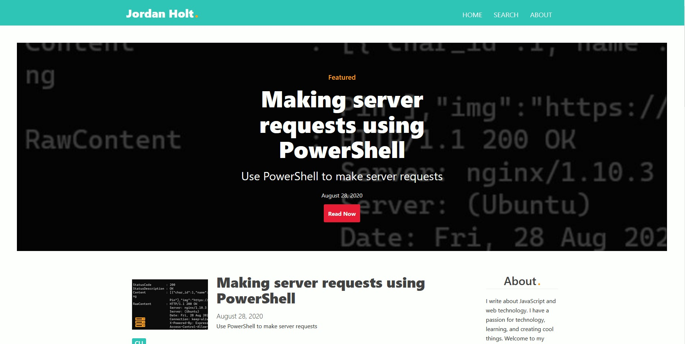

<!-- AUTO-GENERATED-CONTENT:START (STARTER) -->

  </a>

<h1 align="center">
  Personal Blog
</h1>

  
  
  
  

This is the codebase behind my personal blog where I write about web development. 
I created this as a way to sharpen my Gatsby and React skills but primarily as a platform where I could write about the things I'm learning about and interested in. 

You can view the <a href="https://blog.jordanholt.dev/">live site here.</a>

### Features

* Algolia Search feature
* PWA - Progressive Web App
* Responsive Design
* Pagination
* Weekly posts about web development and programming

### Buy me a coffee

Whether you use this codebase, have learned something from one of the articles, or just like it, please consider supporting it by buying me a coffee, so I can dedicate more time to projects like this.

### Technologies

* Gatsby
* React.js
* Styled-Components 
* Hosted & Deployed using Netlify
* npm
* React Instant-Search

### Todo

- Refactor CSS in JS
- Refactor components and create helper functions and config objects

### License

  

