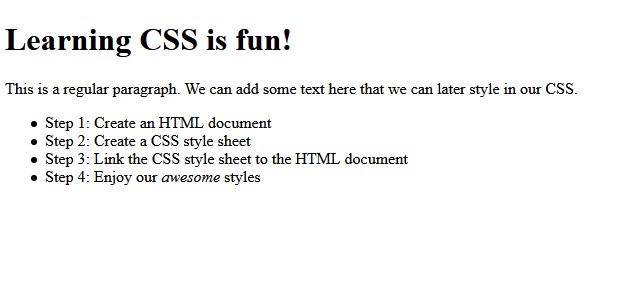
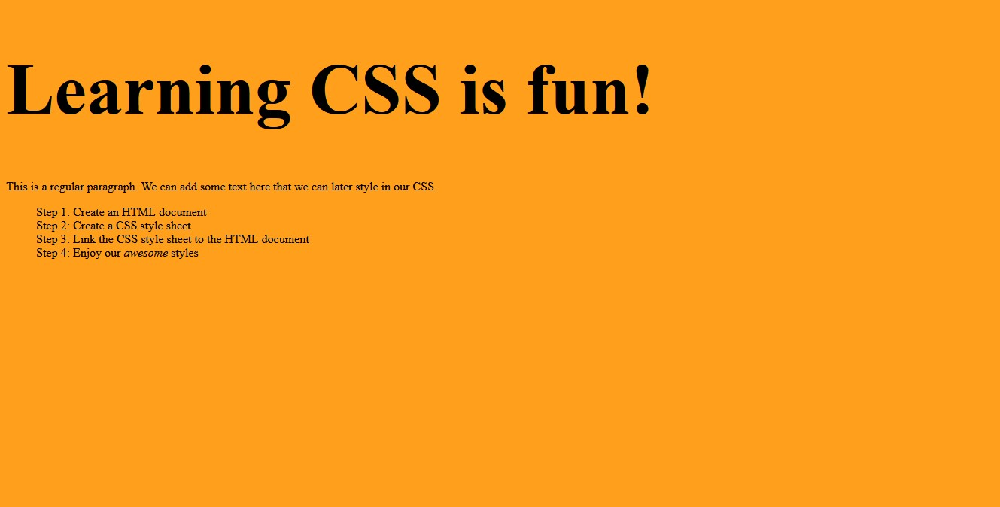

import { Link } from "gatsby"

There are a number of ways to apply CSS to an HTML document but in this post we'll look at one 
of the most commonly used methods - linking. 

### Create an HTML document

First off lets create a basic HTML document. This file will be called `index.html`. The filename extension `.html` 
indicates that this is an HTML file.

```html 
<!doctype html>
<html lang="en">
<head>
    <meta charset="utf-8">
    <title>How to add CSS to an HTML document</title>
</head>

<body>
    
    <h1>Learning CSS is fun!</h1>

    <p>This is a regular paragraph. We can add some text here that we can later style in our CSS.</p>

    <ul>
        <li>Step 1: Create an HTML document</li>
        <li>Step 2: Create a CSS style sheet</li>
        <li>Step 3: Link the CSS style sheet to the HTML document</li>
        <li>Step 4: Enjoy our <em>awesome</em>styles</li>
    </ul>

</body>

</html>
```

If you were to load the `index.html` file into a browser 
it would look fairly plain at the moment. It would look something like this:



### Create a CSS style sheet

Let's create a CSS document and add some basic styles. In the same folder we created the `index.html` 
we will now create a file called `styles.css`.  
Once that's been created we can open the `styles.css` file and add the following styles.

```css
body {
    background-color: #FF9F1C;
}

h1 {
    font-size: 5vw;
}

ul {
    list-style: none;
}

```

### Add the CSS to the HTML document

Now that we have a couple of basic styles we can apply these to out `index.html` document.

In the `<head>` of the `index.html` document add the following line of code.

```html
<link rel="stylesheet" href="styles.css">
```

The `<link>` element allows us to link external resources like stylesheets to our documents. 
If we now load the `index.html` document into a browser you should see that our basic styles have been 
applied. 

It should look something like this:



If you've been following along on your own computer and your styles haven't been applied after you added 
the `<link>` element to the HTML document double check that there are no typos. Also make sure that your CSS
document and your HTML document are in the same folder.

## Wrap up

In this post you saw how you can link a CSS document to an HTML document using the `<link>` element and applied 
some basic styles. This isn't the only way to apply styles to an HTML file but it is a very common approach that
you're sure to see in many projects. 

Make sure to check out the [MDN article on the link element](https://developer.mozilla.org/en-US/docs/Web/HTML/Element/link) 
for more information. And have a look <Link to={`/tags/css`}>my other CSS articles</Link> for more tips and tricks.