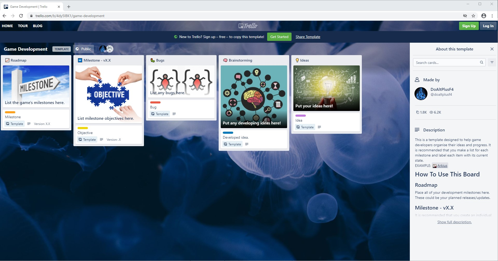
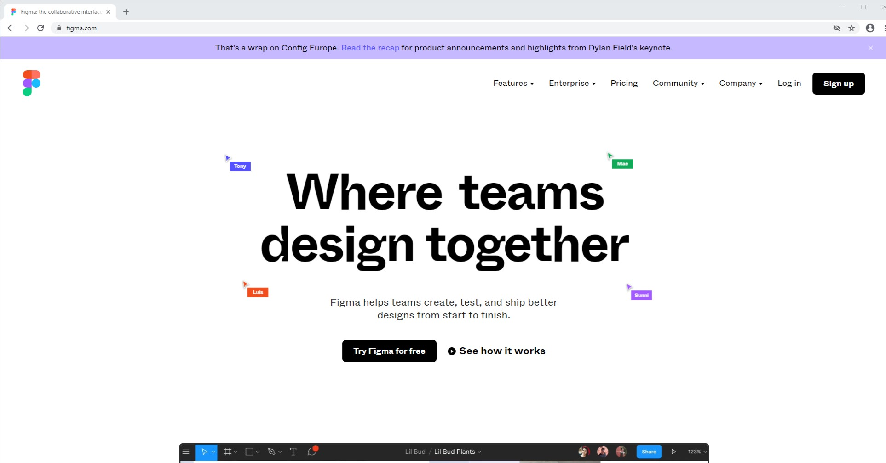
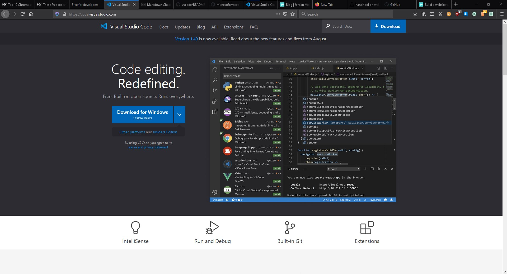
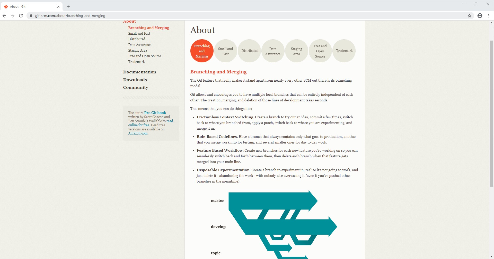
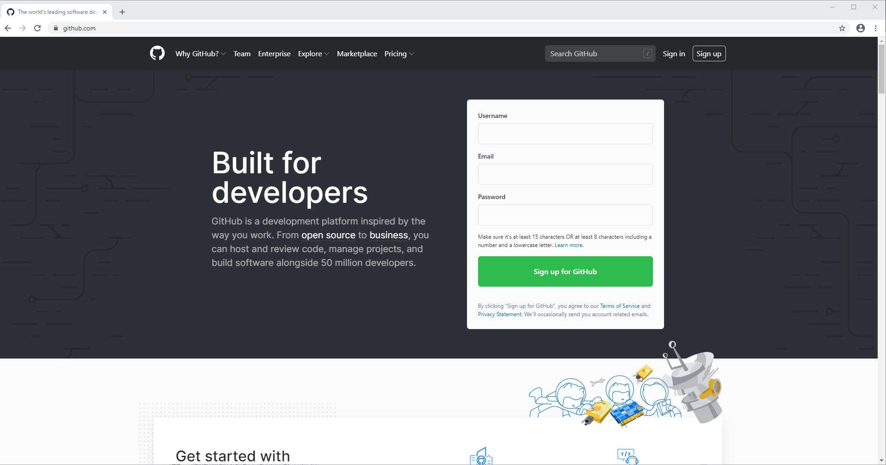
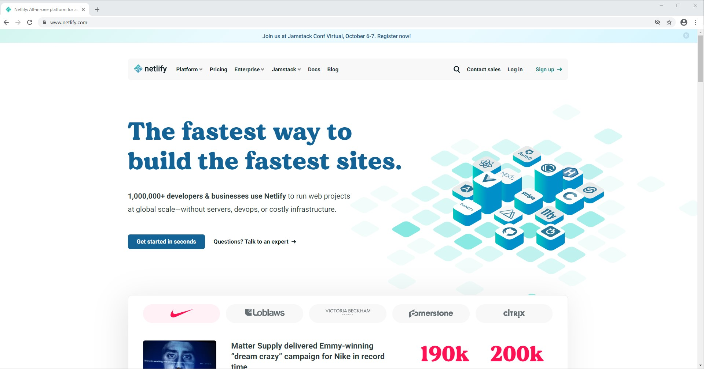

With the huge number of tools available to web developers these days, it can be overwhelming to decide what tools work best for you and your project. It takes time to try out different tools, develop your preferences and to determine what tools are appropriate for your projects. This is especially true if you're just getting started as a developer. That's why I've made this short list of free tools that you can use to design, develop and deploy a static website. 

## 1. [Trello](https://trello.com)

Once you've got an idea for your website, I'd suggest that you create a central place to organize the project. Organizing your todos, schedule, stretch goals and content can help keep you on track and add some urgency to your project, which might mean the difference between completing it or not. This can be as simple as a note book or pad of paper, but I like to keep everything related to my project in one easily accessible place. 

My current preference is Trello. Trello is a web-based project management app that uses lists and [Kanban-style](https://en.wikipedia.org/wiki/Kanban_(development)) boards for organization. It has a forever-free tier and allows team collaboration, automation and [integration](https://trello.com/power-ups) with other productivity apps. There are also a wide variety of [templates](https://trello.com/templates) available that you can modify for your use case. 

## 2. [Figma](https://www.figma.com/)

Once you've refined your idea, you'll need to start to design what it will look like. This often starts out with creating basic sketches and [wireframes](https://en.wikipedia.org/wiki/Website_wireframe) done on paper. However, you'll eventually want a better sense of what the final site will look like by creating more detailed mockups and prototypes. 

Figma is a graphics editor and prototyping tool. From basic wireframes to detailed and interactive prototypes, Figma is a powerful design tool. It has a free tier and is available for Windows, macOS and Linux.

## 3. [Visual Studio Code](https://code.visualstudio.com/)

After you've decided on your design, it's time to start coding! There are a number of great code editors available, but one of the most popular and my current editor, is Visual Studio Code. 

Visual Studio Code is a free code editor built on the open source [Code - OSS](https://github.com/microsoft/vscode/blob/master/README.md). It's available for Windows, macOS and Linux. It's highly customizable and has a large number of [extensions](https://code.visualstudio.com/docs/editor/extension-gallery) available to help accommodate different workflows. Here are a few of the extensions I use regularly.

* [Auto Close Tag](https://marketplace.visualstudio.com/items?itemName=formulahendry.auto-close-tag) - automatically closes HTML/XML tags. 
* [Auto Rename Tag](https://marketplace.visualstudio.com/items?itemName=formulahendry.auto-rename-tag) - automatically renames closing tags.
* [IntelliSense for CSS class names in HTML](https://marketplace.visualstudio.com/items?itemName=Zignd.html-css-class-completion) - CSS classname completion for CSS definitions in your workspace. 
* [NPM Intellisense](https://marketplace.visualstudio.com/items?itemName=christian-kohler.npm-intellisense) - Autocompletes npm modules in import statements.
* [Path IntelliSense](https://marketplace.visualstudio.com/items?itemName=christian-kohler.path-intellisense) - Extension that autocompletes filenames.
* [ESLint](https://marketplace.visualstudio.com/items?itemName=dbaeumer.vscode-eslint) - Integrates ESLint into VS Code.
* [Bracket Pair Colorizer](https://marketplace.visualstudio.com/items?itemName=coenraads.bracket-pair-colorizer) - This extension allows matching brackets to be identified with colours. 
* [vscode-styled-components](https://marketplace.visualstudio.com/items?itemName=jpoissonnier.vscode-styled-components) - Syntax highlighting and IntelliSense for styled-components.
* [MDX](https://marketplace.visualstudio.com/items?itemName=silvenon.mdx) - MDX langauge support for VS Code.
* [Material Icon Theme](https://marketplace.visualstudio.com/items?itemName=PKief.material-icon-theme) - Material Icons inside of VS Code
* [Monokai++](https://marketplace.visualstudio.com/items?itemName=dcasella.monokai-plusplus) - This is my current theme in VS Code. 

## 4. [Git](https://git-scm.com/)

After you've written some code for your site, you might want to add some features or just experiment with the code a bit. This is where [version control](https://git-scm.com/video/what-is-version-control) comes in. Version control allows you to create different branches of your code that you can experiment with, if something doesn't work out just revert back to the original  version.  

Git is an free and open source version control system that is widely used in software development. Most developers use Git so it's a great idea to learn the basics.  It is available for Mac, Windows and Linux. 

## 5. [GitHub](https://github.com/)

If you're already using Git for version control, you can now decide to use an online software hosting site like GitHub. You can push your code up to a remote repository that is hosted on GitHub, which can serve as a backup location or allow you to collaborate with other developers. 

GitHub has a free tier which includes unlimited repositories. It has some other great features like [GitHub Actions](https://github.com/marketplace?type=actions) which allow users to create advanced automations. GitHub also has a service called [GitHub Pages](https://pages.github.com/) which allows you to create a site directly from a GitHub repository. 

## 6. [Netlify](https://www.netlify.com/)

After all the hard work you've done on your site its time to deploy and share it! There are an endless number of hosting options available for static websites but I like using Netlify. Netlfiy has automated builds from Git , allows you use custom domains and offers free SSL certificates. 

Netlify has a free tier that has enough [features](https://www.netlify.com/pricing/#features) to help you get started.

## Wrap up 

There are a ton of amazing tools available to web developers these days.  You don't always need to spend money to build your projects, especially when you're starting out. It's worth taking some time to explore the free tools that are available to us, discover your preferences and decide what works best for you projects. 