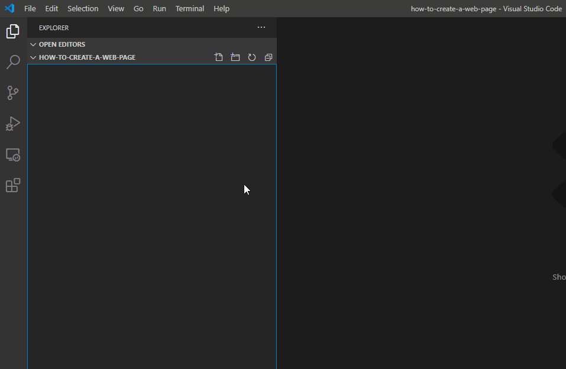
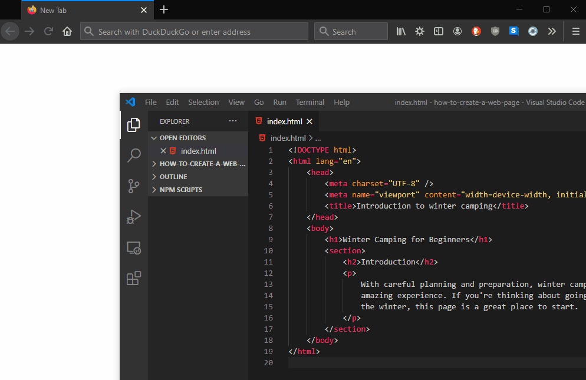
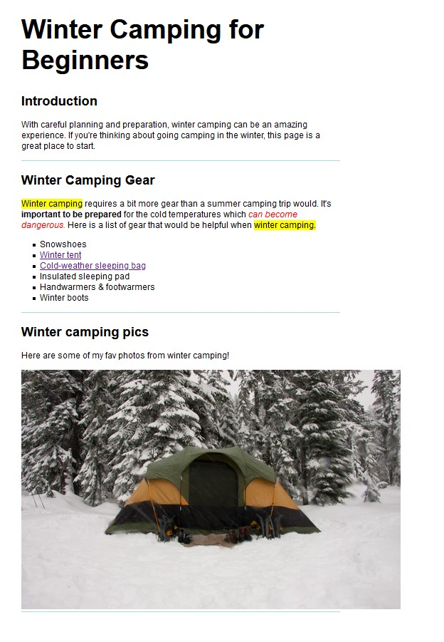

In this tutorial we'll build a simple web page using HTML. This is aimed at people who are starting out with HTML but have a basic understanding of the syntax. If you're completely new to HTML you can still follow along and learn a few things. Make sure to check out the [W3C introduction to HTML](https://www.w3.org/TR/html52/introduction.html#a-quick-introduction-to-html) if you're interested in a deep dive about HTML.

You can find [the completed code for this tutorial here](https://gist.github.com/jordanholtdev/395c37b6fa8f4804be3a584d32c7274d).

## 1. Create a new HTML file

First we'll need to do is create a new document. There are a few ways we can create a document but I'll be using the text editor [VS Code](https://code.visualstudio.com/) to do this. You can use any text editor you prefer.

Here are the steps for creating a new file in VS Code.

1. Open VS Code
2. Select "New File" in the File menu or press `Ctrl` + `N` on Windows or `Cmd` + `N` on macOS.
3. Select "Save" in the File menu or press `Ctrl` + `S` on Windows or `Cmd` + `S` on macOS. You will then be prompted to enter a name of the file.



- HTML documents should have `.html` file extensions.
- Generally the homepage of a site is named "index.html". "index" indicates that this is the default file that the browser will load.
- You should only use alphanumerics, dashes, underscores, or tildes in the page name.
- Don't use spaces in the file name
- Use lower case letters when naming HTML files. The name of an HTML resource is typically used in a URL. URLs are generally case-sensitive.

## 2. Create a basic HTML document

Now that we have an HTML file we can start writing some HTML to create our web page. We'll start by adding a few elements that are typically found in most HTML files.

- **[`<!DOCTYPE html>`](https://html.spec.whatwg.org/multipage/syntax.html#the-doctype)** - The purpose of the DOCTYPE is to [trigger the correct rendering mode](https://developer.mozilla.org/en-US/docs/Web/HTML/Quirks_Mode_and_Standards_Mode). This is required for legacy reasons and if you're starting out it's not something to focus on. `<!DOCTYPE html>` is recommended by HTML5 and what you'll use for most projects as well as what we're using for this tutorial. It must be the first thing in the HTML file and it does not require a closing tag.

Add the DOCTYPE to the first line of the HTML file:

```html
<!DOCTYPE html>
```

- **[`<html>`](https://html.spec.whatwg.org/multipage/semantics.html#the-html-element)** - The html element represents the root of the document. All other elements are descendants of the html element. Basically this tells the browser that everything inside this element is html. The html element will generally have a closing tag, but in some cases it is not required. It also has `lang` attribute that indicates the document's language and is helps with speech synthesis.

Now add the html element to your file like this:

```html
<!DOCTYPE html>
<html lang="en"></html>
```

- **[`<head>`](https://html.spec.whatwg.org/multipage/semantics.html#the-head-element)** - The head element is used to contain metadata about the document. This metadata is machine-readable and is used to set up the presentation or behaviour of the content, or the relationship of the document with other documents. This could be data such as the title, scripts, CSS style sheets, analytics etc.

Add the head element inside the html element:

```html
<!DOCTYPE html>
<html lang="en">
  <head> </head>
</html>
```

- **[`<body>`](https://html.spec.whatwg.org/multipage/sections.html#the-body-element)** - The body element represents the contents of the document. There can only be one body element in a document.

Add the body element inside the html element right after the head:

```html
<!DOCTYPE html>
<html lang="en">
  <head> </head>
  <body></body>
</html>
```

- **[`<title>`](https://html.spec.whatwg.org/multipage/semantics.html#the-title-element)** - The title element will represent the name of the document, this is what will appear in the browser tab. The title element is metadata content and so it is used inside the head element. There should only be one title element per document.

Add the title element inside the head element and name it however you'd like:

```html
<!DOCTYPE html>
<html lang="en">
  <head>
    <title>Introduction to winter camping</title>
  </head>
  <body></body>
</html>
```

You'll noticed how some of the elements are now indented, this is done to make the code easier to read. Indenting is an opinionated area of coding. Everyone has there own preferences but as long as it's consistent and serves to increase readability then use [any style you prefer](https://en.wikipedia.org/wiki/Indentation_style). For this tutorial I'm using a code formatter called [Prettier](https://marketplace.visualstudio.com/items?itemName=esbenp.prettier-vscode) which is set to automatically format the HTML document when I save.

There is one more element that we'll add to this basic layout, which you'll frequently see.

- **[`<meta>`](https://html.spec.whatwg.org/multipage/semantics.html#the-meta-element)** - The meta element represents different types of metadata. There are many different uses for the meta tag, but there are two which you'll regularly see (especially if you're using [HTML snippets](https://code.visualstudio.com/docs/editor/emmet)) and these are the ones we'll discuss.

Let's add the two meta elements inside the head element:

```html
<!DOCTYPE html>
<html lang="en">
  <head>
    <meta charset="UTF-8" />
    <meta name="viewport" content="width=device-width, initial-scale=1.0" />
    <title>Introduction to winter camping</title>
  </head>
  <body></body>
</html>
```

The first meta element with the attribute `charset="UTF-8"` is called a [character encoding declaration.](https://html.spec.whatwg.org/multipage/semantics.html#charset), this indicates which [character encoding](https://en.wikipedia.org/wiki/Character_encoding) is used to store or transmit the document. If you're just starting out, don't worry too much about the technical aspects of this element, but it's a good idea to understand what it does if you see it.

The second second meta element is called a [viewport meta tag](https://developer.apple.com/library/archive/documentation/AppleApplications/Reference/SafariWebContent/UsingtheViewport/UsingtheViewport.html#//apple_ref/doc/uid/TP40006509-SW32) and it was introduced by Apple so that developers could modify the viewport size and scale. While this meta tag is very common due to the need to support mobile devices, it is not necessary for all web pages.

## 3. Sections, headings & paragraph text

If we were to view this page in a browser you wouldn't actually see anything rendered in the viewport. That's because we haven't added any content to the body element. So let's add some content to this web page.

- **[`<section>`](https://html.spec.whatwg.org/multipage/sections.html#the-section-element)** - A section element can represent a certain section of the document. In this example the web page is going to have an introduction section, a camping gear section, a photo section.
- **[h1, h2, h3, h4, h5 & h6 elements](https://html.spec.whatwg.org/multipage/sections.html#the-h1,-h2,-h3,-h4,-h5,-and-h6-elements)** - These represent headings in the document are an important part of a web page. Headlines have an SEO value and are also [important for accessibility](https://www.w3.org/WAI/WCAG21/Techniques/general/G130.html). We'll learn more about semantics and structuring web pages in future tutorials, for now note that headings are important parts of a web page.
- **[`<p>`](https://html.spec.whatwg.org/multipage/grouping-content.html#the-p-element)** - The p element represent paragraph text.

Let's go ahead and add the first section and it's elements, feel free to follow along with this example or put your own spin on the web page.

```html
<!DOCTYPE html>
<html lang="en">
  <head>
    <meta charset="UTF-8" />
    <meta name="viewport" content="width=device-width, initial-scale=1.0" />
    <title>Introduction to winter camping</title>
  </head>
  <body>
    <h1>Winter Camping for Beginners</h1>
    <section>
      <h2>Introduction</h2>
      <p>
        With careful planning and preparation, winter camping can be an amazing
        experience. If you're thinking about going camping in the winter, this
        page is a great place to start.
      </p>
    </section>
  </body>
</html>
```

## 4. Preview in the browser

Now that we have some content in the body of the document, let's have a look at what it looks like in browser. One of the simplest ways to do this is by dragging the HTML file into an open browser tab.



You will need to reload the browser tab to view any changes to the HTML you might have made. Another option is to use a live preview, for example VS Code has a [popular extension called Live Server](https://marketplace.visualstudio.com/items?itemName=ritwickdey.LiveServer) that allows you to click a button to view the file and will listen for changes and update accordingly.

## 5. Create a list

The second content section on this web page is going to be a list of gear you might need to go winter camping. Let's have a look at the elements we'll need to create this.

- **[`<ul>`](https://html.spec.whatwg.org/multipage/grouping-content.html#the-ul-element)** - The ul element stands for unordered list and represents a list of items where the order of the items is not important.
- **[`<li>`](https://html.spec.whatwg.org/multipage/grouping-content.html#the-li-element)** - The li element represents a list item.

Now that we know what elements we will use, let's go ahead and create another section that will contain our list of camping gear:

```html
<!DOCTYPE html>
<html lang="en">
  <head>
    <meta charset="UTF-8" />
    <meta name="viewport" content="width=device-width, initial-scale=1.0" />
    <title>Introduction to winter camping</title>
  </head>
  <body>
    <h1>Winter Camping for Beginners</h1>
    <section>
      <h2>Introduction</h2>
      <p>
        With careful planning and preparation, winter camping can be an amazing
        experience. If you're thinking about going camping in the winter, this
        page is a great place to start.
      </p>
    </section>
    <section>
      <h2>Winter Camping Gear</h2>
      <p>
        Winter camping requires a bit more gear than a summer camping trip
        would. It's important to be prepared for the cold temperatures which can
        become dangerous. Here is a list of gear that would be helpful when
        winter camping.
      </p>
      <ul>
        <li>Snowshoes</li>
        <li>Winter tent</li>
        <li>Cold-weather sleeping bag</li>
        <li>Insulated sleeping pad</li>
        <li>Handwarmers & footwarmers</li>
        <li>Winter boots</li>
      </ul>
    </section>
  </body>
</html>
```

## 6. Formatting the text

Now that we have a bit more content let's add some formatting to the text. Formatting will change the appearance of the text and help make the page more readable. There are [several different elements](https://html.spec.whatwg.org/multipage/text-level-semantics.html#text-level-semantics) we can use to accomplish this:

- `<b>` - This element represents bold text. It's used to draw attention to or convey extra importance to specific text.
- `<strong>` - This will render the same as the `<b>` element, however `<strong>` is semantic and helps describe the text it surrounds.
- `<i>` - This element represents italic text and is used for an alternate mood from the regular text.
- `<em>` - This marks the text to have emphasis
- `<mark>` - This represents text that is highlighted or marked for reference.
- `<small>` - This represents side-comments and the text it surrounds will render smaller.
- `<del>` - This represents deleted text.
- `<ins>` - This is used to represent inserted text. ins and del are both used to help track changes of a document.
- `<sub>` - This element represents subscript text. Subscripts are rendered with a lowered baseline & smaller text.
- `<sup>` - This element represents superscript text. The text is rendered with a raised baseline & smaller text.

Let's go ahead and add a few of these elements to the previous paragraph section that we added.

```html
<!DOCTYPE html>
<html lang="en">
  <head>
    <meta charset="UTF-8" />
    <meta name="viewport" content="width=device-width, initial-scale=1.0" />
    <title>Introduction to winter camping</title>
  </head>
  <body>
    <h1>Winter Camping for Beginners</h1>
    <section>
      <h2>Introduction</h2>
      <p>
        With careful planning and preparation, winter camping can be an amazing
        experience. If you're thinking about going camping in the winter, this
        page is a great place to start.
      </p>
    </section>
    <section>
      <h2>Winter Camping Gear</h2>
      <p>
        <mark>Winter camping</mark> requires a bit more gear than a summer
        camping trip would. It's <strong>important to be prepared</strong> for
        the cold temperatures which <em>can become dangerous.</em> Here is a
        list of gear that would be helpful when <mark>winter camping.</mark>
      </p>
      <ul>
        <li>Snowshoes</li>
        <li>Winter tent</li>
        <li>Cold-weather sleeping bag</li>
        <li>Insulated sleeping pad</li>
        <li>Handwarmers & footwarmers</li>
        <li>Winter boots</li>
      </ul>
    </section>
  </body>
</html>
```

## 7. Create a hyperlink

> Start of the World Wide Web is the ability to define links from one page to another, and to follow links at the click of a button. This is Hyperlink.
>
> -- <cite>World Wide Web Consortium (W3C)</cite>

[Hyperlinks](https://html.spec.whatwg.org/multipage/links.html#hyperlink) are what make the web an actual web and are an important part of any web page. Almost any type of content can be converted to a hyperlink so that when a user clicks on that link they are brought to another URL.

We can create a hyperlink using the following element:

- **[`<a>`](https://html.spec.whatwg.org/multipage/text-level-semantics.html#the-a-element)** - The a elemet or anchor element, has an attribute called **href**, that when used creates a hyperlink.

Let's have a look at an example below:

```html
<a href="https://www.w3.org/">the World Wide Web Consortium homepage</a>.
```

Which would result in:

<a href="https://www.w3.org/">the World Wide Web Consortium homepage</a>.

Okay so know that we know the basics, let's add a couple of hyperlinks to the list of winter camping gear. When a user activates them they will be brought to another address.

```html
<!DOCTYPE html>
<html lang="en">
  <head>
    <meta charset="UTF-8" />
    <meta name="viewport" content="width=device-width, initial-scale=1.0" />
    <title>Introduction to winter camping</title>
  </head>
  <body>
    <h1>Winter Camping for Beginners</h1>
    <section>
      <h2>Introduction</h2>
      <p>
        With careful planning and preparation, winter camping can be an amazing
        experience. If you're thinking about going camping in the winter, this
        page is a great place to start.
      </p>
    </section>
    <section>
      <h2>Winter Camping Gear</h2>
      <p>
        <mark>Winter camping</mark> requires a bit more gear than a summer
        camping trip would. It's <strong>important to be prepared</strong> for
        the cold temperatures which <em>can become dangerous.</em> Here is a
        list of gear that would be helpful when <mark>winter camping.</mark>
      </p>
      <ul>
        <li>Snowshoes</li>
        <li>
          <a href="https://www.rei.com/c/backpacking-tents/f/se-4-season"
            >Winter tent</a
          >
        </li>
        <li>
          <a href="https://www.rei.com/c/sleeping-bags-and-accessories"
            >Cold-weather sleeping bag</a
          >
        </li>
        <li>Insulated sleeping pad</li>
        <li>Handwarmers & footwarmers</li>
        <li>Winter boots</li>
      </ul>
    </section>
  </body>
</html>
```

## 8. Style the web page

If we have preview the web page right now we'll see that it's not the most exciting to look at. We can change that by adding some basic styles to the HTML document. To do this we'll add a `<style>` element which allow us to embed CSS in the HTML document.

We'll add the style element in the head element of the HTML document. I won't go into detial about the CSS that I've included, if you're curious about anything specific check out the [MDN CSS reference docs](https://developer.mozilla.org/en-US/docs/Web/CSS/Reference).

```html
<!DOCTYPE html>
<html lang="en">
  <head>
    <meta charset="UTF-8" />
    <meta name="viewport" content="width=device-width, initial-scale=1.0" />
    <title>Introduction to winter camping</title>
    <style>
      html {
        max-width: 800px;
      }
      body {
        background-color: white;
        margin: 0 4rem;
        font-family: Arial, Helvetica, sans-serif;
        font-size: 1.15rem;
      }
      section {
        border-bottom: lightblue solid 2px;
      }
      h1 {
        font-size: 3em;
      }
      ul,
      li {
        list-style: square;
      }
      em {
        color: red;
      }
    </style>
  </head>
  <body>
    <h1>Winter Camping for Beginners</h1>
    <section>
      <h2>Introduction</h2>
      <p>
        With careful planning and preparation, winter camping can be an amazing
        experience. If you're thinking about going camping in the winter, this
        page is a great place to start.
      </p>
    </section>
    <section>
      <h2>Winter Camping Gear</h2>
      <p>
        <mark>Winter camping</mark> requires a bit more gear than a summer
        camping trip would. It's <strong>important to be prepared</strong> for
        the cold temperatures which <em>can become dangerous.</em> Here is a
        list of gear that would be helpful when <mark>winter camping.</mark>
      </p>
      <ul>
        <li>Snowshoes</li>
        <li>
          <a href="https://www.rei.com/c/backpacking-tents/f/se-4-season"
            >Winter tent</a
          >
        </li>
        <li>
          <a href="https://www.rei.com/c/sleeping-bags-and-accessories"
            >Cold-weather sleeping bag</a
          >
        </li>
        <li>Insulated sleeping pad</li>
        <li>Handwarmers & footwarmers</li>
        <li>Winter boots</li>
      </ul>
    </section>
  </body>
</html>
```

## 9. Add an image to the page

Web pages without images can sometimes be pretty boring, so let's go ahead and add an image to this page. To add an image we'll use the [img](https://html.spec.whatwg.org/multipage/embedded-content.html#the-img-element) element.

- **[``](https://html.spec.whatwg.org/multipage/embedded-content.html#the-img-element)** - This element represents an image. It must contain the [src](https://html.spec.whatwg.org/multipage/embedded-content.html#attr-img-src) attribute which will indicate the image URL. We'll also be using the [alt](https://html.spec.whatwg.org/multipage/images.html#alt) attribute which is important for accessibility. We write an alternate text for the image so that if every image was not present the alt attribute would convey the same meaning.

In this case we are going to use an image of winter camping from a stock photo website, however you could use a locally saved image as well. Let's go ahead and add another section with a heading, a brief paragraph describing the section and then our image:

```html
<!DOCTYPE html>
<html lang="en">
  <head>
    <meta charset="UTF-8" />
    <meta name="viewport" content="width=device-width, initial-scale=1.0" />
    <title>Introduction to winter camping</title>
    <style>
      html {
        max-width: 800px;
      }
      body {
        background-color: white;
        margin: 0 4rem;
        font-family: Arial, Helvetica, sans-serif;
        font-size: 1.15rem;
      }
      section {
        border-bottom: lightblue solid 2px;
      }
      h1 {
        font-size: 3em;
      }
      ul,
      li {
        list-style: square;
      }
      em {
        color: red;
      }
    </style>
  </head>
  <body>
    <h1>Winter Camping for Beginners</h1>
    <section>
      <h2>Introduction</h2>
      <p>
        With careful planning and preparation, winter camping can be an amazing
        experience. If you're thinking about going camping in the winter, this
        page is a great place to start.
      </p>
    </section>
    <section>
      <h2>Winter Camping Gear</h2>
      <p>
        <mark>Winter camping</mark> requires a bit more gear than a summer
        camping trip would. It's <strong>important to be prepared</strong> for
        the cold temperatures which <em>can become dangerous.</em> Here is a
        list of gear that would be helpful when <mark>winter camping.</mark>
      </p>
      <ul>
        <li>Snowshoes</li>
        <li>
          <a href="https://www.rei.com/c/backpacking-tents/f/se-4-season"
            >Winter tent</a
          >
        </li>
        <li>
          <a href="https://www.rei.com/c/sleeping-bags-and-accessories"
            >Cold-weather sleeping bag</a
          >
        </li>
        <li>Insulated sleeping pad</li>
        <li>Handwarmers & footwarmers</li>
        <li>Winter boots</li>
      </ul>
    </section>
    <section>
      <h2>Winter camping pics</h2>
      <p>Here are some of my fav photos from winter camping!</p>
      
    </section>
  </body>
</html>
```

Let's have a look at what the web page looks like now.



As the [The Net Ninja](https://www.youtube.com/channel/UCW5YeuERMmlnqo4oq8vwUpg) would say, it's not going to win any design awards but for our first web page it's starting to take shape.

## Wrap up

In this tutorial we learned how to create an HTML document, we learned about some commonly used elements such as lists, images, hyperlinks, headings and paragraphs. We applied some basic styles and formatting to the text to make the design a bit more appealing.

From here I'd suggest to roll up your sleeves and start coding your own HTML page from scratch. Once you're a bit more confident, build something more complex using just HTML. There are a ton of trendy frameworks, libraries and other tooling out there to help you build web pages but you can build some incredible things just with HTML and sharpening your HTML skills will make you a better developer and the web a better place.

[Click / activate this link to view](https://gist.github.com/jordanholtdev/395c37b6fa8f4804be3a584d32c7274d) the final code for this web page.

## Further reference

- [HTML and URLs - W3C](https://www.w3.org/TR/WD-html40-970708/htmlweb.html)
- [Indentation Style](https://en.wikipedia.org/wiki/Indentation_style)
- [Viewport meta tag - Apple](https://developer.apple.com/library/archive/documentation/AppleApplications/Reference/SafariWebContent/UsingtheViewport/UsingtheViewport.html#//apple_ref/doc/uid/TP40006509-SW32)
- [HTML Validator - WHATWG](https://whatwg.org/validator/)
- [Cheat sheet - W3C](https://www.w3.org/2009/cheatsheet/#search,doctype)
- [HTML Semantics](https://html.spec.whatwg.org/multipage/semantics.html#the-html-element)
