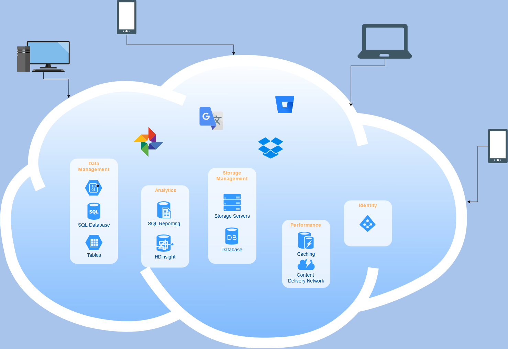

The demand for qualified individuals in cloud computing is on the rise and it doesn't look to be slowing down. As more industries start to transition to a cloud model the demand for cloud skills will continue to grow. The global public cloud revenue is expected to grow to over 💲300B in 2021.

Now is a great time to learn a new skill and familiarize yourself with the rapidly changing field.

But where should you start? In this article we'll start with the basics and learn all about cloud computing fundamentals.

## What is the cloud?

The term cloud is basically referring to a data center or multiple data centers that are connected to each other, and are then made available to users through the internet. Instead of having to manage computer resources, they can be accessed via the cloud on demand.

Users do not have to directly manage the hardware or software, they can simply click to access these computing resources.

## Data centers & hosting providers

To better understand what cloud computing is, let's first look at what a typical workflow might look like for a company before cloud computing became so popular.

Let's say a company wanted to host a website. They might have a system administrator who will be responsible for the configuration and operation of the server that hosts the website.

The sysadmin might be responsible for helping to:

- **Evaluate and choose the data center or hosting provider**
- **Determine and provide server requirements to data center / hosting provider**
- **Negotiate final services**

Any issues or problems that arrive require the sysadmins attention. Let's have a closer look at the two main methods of acquiring servers or computer resources.

### Data centers

Before cloud computing became so popular, companies often directly dealt with [data centers](https://en.wikipedia.org/wiki/Data_center). A data center can house thousands of servers owned by private companies or individuals. They also might rent physical servers to companies who don't provide their own.

**Common features**

- Dedicated space designed to house computer systems and any associated technology.
- Data centers can contain redundant systems such as power backups and environmental controls
- Data centers can help provide physical security to the servers

**Cons**

- Any additional server specifications require a technician to physically implement -e.g., someone physically installs additional RAM
- While the data center might have redundant systems and protections, if the entire facility failed so would the server.
- The negotiations and pricing process can take some time.

Negotiating and pricing requires a bit more effort with data centers as the server configuration, associated components such as internet connection, power and cooling need to be determined. When you're dealing larger projects this process can take a long time and if rushed can end up costing a lot of money.

### Hosting providers

Generally with a hosting provider, instead of buying or renting a physical server in a data center you pay a monthly fee and get a dedicated server, the hosting provider takes care of the rest. You choose the available servers that the hosting provider offers and any additional configuration. The hosting provider deals with all the physical requirements of the server. A hosting provider is often just a company that owns servers in a data center and charges a fixed price to rent those managed servers.

**Common features**

- Monthly fixed price for dedicated server.
- Easier to get started and configure
- The hosting provider will connect with the data center to implement changes to your server

**Cons**

- Any additional server specifications require a support ticket - .e.g., contact the hosting provider to request additional RAM, response time will vary.
- Cost can be steep. Pay a fixed price regardless of usage.

One of the biggest downsides of a hosting provider besides the fixed cost, is the reliance on them to implement changes to the server in timely manner. For example, if you want to increase the RAM you submit a ticket and then wait for them to respond. Response times will vary and in fact it can be an additional cost for priority support.

So far we've looked at two ways to acquire computer resources. Data centers, where a physical server is housed and hosting providers that charge a fixed monthly fee for a dedicated server. With those options, we either have to have someone physically upgrade our server, or in the case of the hosting provider, create a ticket and wait for them to apply the upgrades.

Let's look at how cloud computing helps us avoid those obstacles.

## Intro to cloud computing

Cloud computing is a model that makes computer resources available as a service. Users can easily launch these services without any human intervention. No more waiting around to hear back from a data center or hosting provider.

Here are three of the main characteristics of cloud computing:

1. **Services are on-demand & self-serviced** - A user can implement without any manual intervention.
2. **Elasticity** - Must be able to scale up and down anytime
3. **Measured** - Only pay for what you used, no fixed cost.

Cloud computing providers offer their services via three main models. Cloud providers may offer services in more than model, or they might only specialize in one area.

### Software as a service (SaaS)

In the SaaS model, the cloud providers install an application in the cloud and handle all the infrastructure and necessary platforms for the application to run. Users can access the application from cloud clients, this way users do not need to download or install the application. The application is running in the cloud and it can be accessed via the browser.

Examples:

- [Google Docs](https://docs.google.com/)
- [Microsoft 360](https://www.microsoft.com/en-ca/microsoft-365)

### Platform as a service (PaaS)

In this model cloud providers will setup the necessary infrastructure and platforms for users to develop an application. This can include an operating system, web server and other necessary elements. Users can then develop and deploy applications on that platform.

Examples:

- [Google App Engine](https://cloud.google.com/appengine)
- [Microsoft Azure App Service](https://azure.microsoft.com/en-ca/services/app-service/)

### Infrastructure as a service (IaaS)

As its name suggests, this model provides infrastructure as a service. Typically this means things like servers and databases.

Examples:

- [Digital Ocean](https://www.digitalocean.com/)
- [AWS](https://aws.amazon.com/)

## Cloud providers

There is no shortage of choice when looking for a cloud provider. It can be very easy to spend unnecessary money if you rush to decide.

Take your time when deciding, most of the cloud providers have some sort of free tier if you're interested in trying before buying.

Here are a few popular cloud providers:

- [Microsoft Azure](https://azure.microsoft.com/en-us/)
- [Amazon Web Services (AWS)](https://aws.amazon.com/)
- [Google Cloud Platform](https://cloud.google.com)
- [Oracle](https://www.oracle.com/cloud/)
- [Alibaba Cloud](https://www.alibabacloud.com/campaign/free-trial)

There are a number of smaller providers out there. Not all of them will offer the comprehensive computing services that AWS or Azure will but they might be more economical.

## Wrap up

In this article we saw that the cloud is really just a data center or multiple data centers that are made available through the internet. We saw how things were often done before the cloud became popular.

We learned about the characteristics of cloud computing and looked at different cloud models like SaaS, PaaS and IaaS and some of the major providers. We also began to look at the architecture of cloud environments. In future articles we'll dive deeper into the infrastructure of the cloud.

## Further reference

- [Hosting Provider / Dedicated servers / Cloud - OVH](https://www.ovhcloud.com/en-ca/bare-metal/advance/prices/) - This is a well known hosting provider that also provides cloud services.
- [Cloud Provider - Digital Ocean](https://www.digitalocean.com/)
- [National Institute of Standards and Technology](https://www.nist.gov/)
- [Free for dev ](https://free-for.dev/#/) - Large list of SaaS, IaaS and PaaS services, aimed at DevOp/SysAdmin
