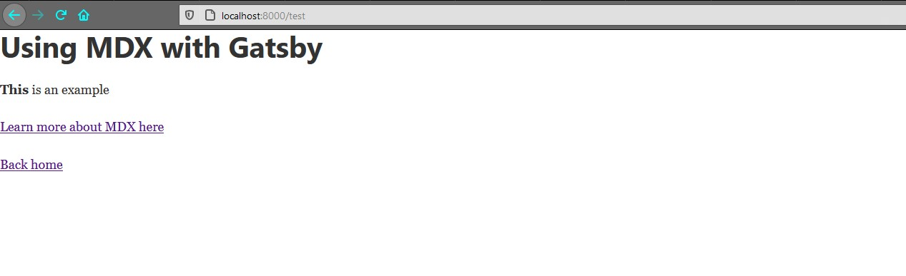
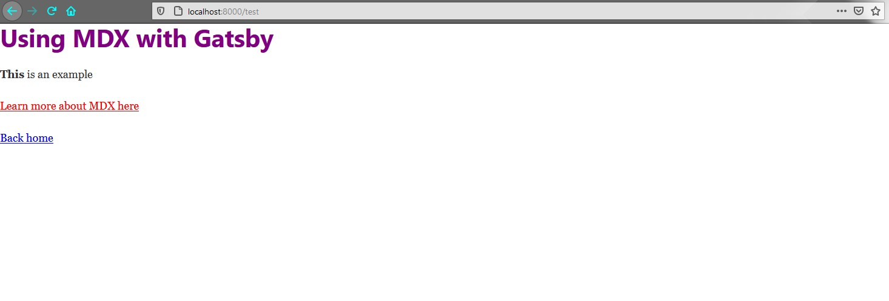

If you're working with MDX in Gatsby, make sure to take advantage of custom components using `MDXProvider`. This can give you the ability to apply your design system consistently across your content when you're using MDX.

In this article we'll use custom components to replace the HTML that is rendered by Markdown. You can easily integrate libraries like `theme-UI` or `Chakra-UI` if you're using an existing design system.

## Getting started

In this example we'll be using the [gatsby-starter-default](https://www.gatsbyjs.com/starters/gatsbyjs/gatsby-starter-default/) project. This assumes you already have the Gatsby CLI installed on your system. If not, you can [read about installing it here](https://www.gatsbyjs.com/docs/quick-start/#use-the-gatsby-cli).

Let's go ahead and install the starter project. I'm naming the project folder "gatsby-custom-mdx-components", but you can name it anything you want.

```bash
 gatsby new gatsby-custom-mdx-components https://github.com/gatsbyjs/gatsby-starter-default
```

Then we can navigate to our project directory and list the contents. Then we'll open up a text-editor (I'm using VS Code) and have a closer look at the package.json file.

```bash
 cd gatsby-custom-mdx-components && ls && code .

d----          2020-10-30  8:22 AM                node_modules
d----          2020-10-30  8:21 AM                src
-a---          2020-10-30  8:21 AM           1043 .gitignore
-a---          2020-10-30  8:21 AM             49 .prettierignore
-a---          2020-10-30  8:21 AM             50 .prettierrc
-a---          2020-10-30  8:21 AM            171 gatsby-browser.js
-a---          2020-10-30  8:21 AM           1111 gatsby-config.js
-a---          2020-10-30  8:21 AM            165 gatsby-node.js
-a---          2020-10-30  8:21 AM            187 gatsby-ssr.js
-a---          2020-10-30  8:21 AM            689 LICENSE
-a---          2020-10-30  8:21 AM           1308 package.json
-a---          2020-10-30  8:21 AM         777362 package-lock.json
-a---          2020-10-30  8:21 AM           5670 README.md

```

The starter is a basic Gatsby project. It comes with a some of the bare-bones plugins like transformer-sharp and React Helmet for SEO but no way to handle MDX out of the box. We'll be using the [gatsby-plugin-mdx](https://www.gatsbyjs.com/plugins/gatsby-plugin-mdx/?=gatsby-plugin-mdx) to programmatically create the MDX pages. This plugin relies on [@mdx-js/mdx](https://www.npmjs.com/package/@mdx-js/mdx) to parse MDX to JSX and [@mdx-js/react](https://www.npmjs.com/package/@mdx-js/react) to implement MDX for React.

Let's go ahead and install these packages.

```bash
npm install gatsby-plugin-mdx @mdx-js/mdx @mdx-js/react
```

You can confirm the install by checking the package.json, you should see the 3 packages installed:

```json{2-3,7}
  "dependencies": {
    "@mdx-js/mdx": "^1.6.19",
    "@mdx-js/react": "^1.6.19",
    "gatsby": "^2.24.91",
    "gatsby-image": "^2.4.21",
    "gatsby-plugin-manifest": "^2.4.37",
    "gatsby-plugin-mdx": "^1.2.52",
    "gatsby-plugin-offline": "^3.2.38",
    "gatsby-plugin-react-helmet": "^3.3.14",
    "gatsby-plugin-sharp": "^2.6.43",
    "gatsby-source-filesystem": "^2.3.37",
    "gatsby-transformer-sharp": "^2.5.20",
    "prop-types": "^15.7.2",
    "react": "^16.12.0",
    "react-dom": "^16.12.0",
    "react-helmet": "^6.1.0"
  },
```

## Configuring the plugin

Now that `gatsby-plugin-mdx` is installed in the project, we'll need to configure the plugin.

We'll need to specificy the location of local MDX files that will be processed. We can do this by specifiying the sources in the `gatsby-source-filesystem` plugin, found in the `gatsby-config.js` file. We'll also need to add `gatsby-plugin-mdx` to the list of plugins in the config file.

```bash
module.exports = {
  plugins: [
    {
      resolve: `gatsby-source-filesystem`,
      options: {
        name: `posts`,
        path: `${__dirname}/src/pages/`,
				name: `pages`,
      },
    },
    `gatsby-plugin-mdx`,
  ],
}

```

Now if we create an MDX file in the pages directory, `gatsby-plugin-mdx` will parse the file. Let's go ahead and create a file called `test.mdx` in the pages directory, and add a bit of markdown to the file.

```markdown
# Using MDX with Gatsby

**This** is an example

[Learn more about MDX here](https://mdxjs.com/getting-started/gatsby)

[Back home](/)
```

We should now be able to view the page by navigating to "/test". It should look something like this:



Great! Now we can create pages using MDX but we still need to ability to use custom components to replace the HTML elements that the Markdown is rendering.

## Custom components

Now that we are able to programmatically create pages with MDX the next step is providing the Markdown with custom components to use. Let's go ahead and create a file call `MDXComponents.js` in the components directory. This is where we'll create our custom components.

Let's add a couple of basic components.

```javascript
// src/components/MDXComponents.js
import React from "react"
import { Link } from "gatsby"

const CustomHeading = props => <h1 style={{ color: "purple" }} {...props} />

const CustomLink = props => {
  const href = props.href
  const isInternalLink = href && (href.startsWith("/") || href.startsWith("#"))

  if (isInternalLink) {
    return <Link to={href} style={{ color: "blue" }} {...props} />
  }
  return <a href={href} style={{ color: "red" }} {...props} />
}

const MDXComponents = {
  h1: CustomHeading,
  a: CustomLink,
}

export default MDXComponents
```

Above, we created two custom components, `Heading1` and `CustomLink`. You'll notice in the CustomLink component, that we're rendering Gatsby Link when the link is internal and a regular `a` element when it's external. You can easily use third-party libraries like `theme-ui` or `Charka-UI` when writing your custom components.

Once these components are defined we then assign them to an object called `MDXComponents` that we will export to use globally with the `MDXProvider`.

Here's a full list of components that can be customized using the MDXProvider:

- `p`
- `h1`
- `h2`
- `h3`
- `h4`
- `h5`
- `h6`
- `thematicBreak`
- `blockquote`
- `ul`
- `ol`
- `li`
- `table`
- `tr`
- `td/th`
- `pre`
- `code`
- `em`
- `strong`
- `delete`
- `inlineCode`
- `hr`
- `a`
- `img`

## MDXProvider

If we look at the test page again, you'll notice that our custom components haven't been applied to the Markdown. We do this by passing the custom components to `MDXProvider` which will make them globally available to MDX that is wrapped by `MDXProvider`. In this example we'll wrap the entire app.

To do this open up `gatsby-browser.js`

```js
import React from "react"
import { MDXProvider } from "@mdx-js/react"
import MDXComponents from "./src/components/MDXComponents"

export const wrapRootElement = ({ element }) => (
  <MDXProvider components={MDXComponents}>{element}</MDXProvider>
)
```

Above, we import React, MDXProvider and our custom components. The entire app is then wrapped with `MDXProvider` and the custom components are passed in.

Now if we head back to the test page you should see that the custom components have been rendered. We can inspect the links and now see that the logic in the `CustomLink` component has been applied to the elements, the internal links are Gatsby Links and the external links are `a` elements each with their own styles.



## Wrap up

Using MDX in your projects can be a great experience for both developers and users. By using custom components via `MDXProvider` you can help streamline your content workflow and keep your design system consistent throughout your project.

## Further Reference

- [Customizing Markdown Components - Gatsby](https://www.gatsbyjs.com/docs/mdx/customizing-components/)
- [Gatsby - MDXJS](https://www.gatsbyjs.com/docs/mdx/customizing-components/)
- [gatsby-plugin-mdx - Gatsby](https://www.gatsbyjs.com/docs/mdx/customizing-components/)
