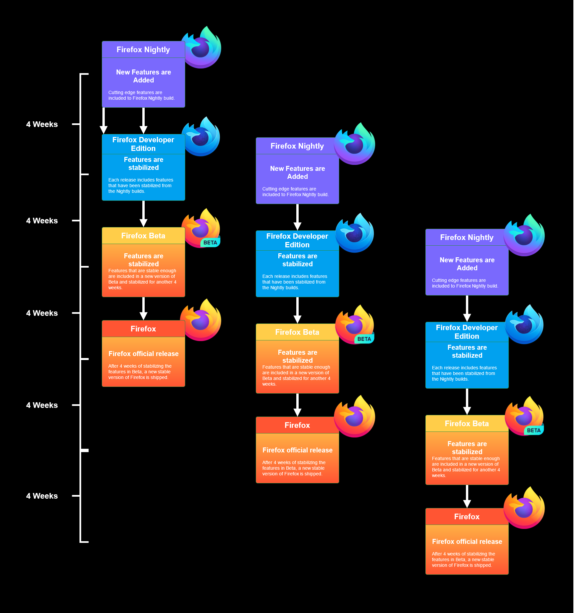

I've been using Firefox for several years as one of my preferred browser, but only recently started using it as my main browser for development. There's lots of great articles about why some people prefer using Firefox for development, but I'm not going to that here. However, I will say that part of my decision is that it's open-source and is more committed to privacy than some other browsers, and the [Firefox developer edition](https://www.mozilla.org/en-CA/firefox/developer/) has some great features that I use all the time. 

If you've decided to try out Firefox for the first time, or are returning to it from another browser I have a few suggestions to help you get started. 

* [Versions](#versions)
* [Customizing](#customizing)
* [General Shortucts](#general-shortcuts)
* [Developer Shortcuts](#developer-shortcuts)
* [Extensions](#extensions)
* [Developer Tools](#developer-tools)

##  Which version should you use?

There are a five different release versions of the Firefox browser, it's a good idea to understand the differences before you choose which one to use.  These five versions are actually  called update channels. Each channel will receive different updates based on the release timeline.  

If you already have Firefox installed and you're not sure what update channel you are on you can do the following:
* In the address bar type `about:config`
* Then in the search box that appears type `app.update.channel`. On the right hand side you'll see the channel name. 

| Name | Update Channel Name | Stable | Description | 
| -------- | -------- | -------- | -------- |
| [Firefox Extended Support Release (ESR)](https://www.mozilla.org/en-US/firefox/enterprise/)    | esr |  Special releases. Stable     | This is a special update channel which is used by large organizations that need extended support. New features are not included regularly in this version. Features are supported for over a year with security and stability updates.      |
| [Firefox](https://www.mozilla.org/en-US/firefox/new/)    | release | Final releases. Stable     | This is the official release. After another 4 weeks of stabilizing the features included in Beta, a new version of Firefox is shipped. |
| [Firefox Beta](https://www.mozilla.org/en-US/firefox/channel/desktop/#beta)  | beta  | Betas / release candidates. Mostly Stable     | Every 4 weeks, features that are stable enough, are included in a new version of Beta. This is the most stable pre-release build.   |
| [Firefox Developer Edition](https://www.mozilla.org/en-US/firefox/developer/)   | aurora  | Pre-beta. Unstable with bugs    | Each release includes the features that have been stabilized from the nightly builds. Includes experimental developer tools and preferences tailored for web devs. New features that are included in this channel are stablilized for 12 weeks prior to appearing in the released version  |
| [Firefox Nightly](https://blog.nightly.mozilla.org/)  | nightly   | Nightly builds. Crashes, unstable with bugs     | Every night Firefox Nightly is built from the latest code. This build contains all the latest features that are still actively being developed.     |

Firefox is currently on a four week [release schedule](https://wiki.mozilla.org/Release_Management/Calendar), which means every four weeks there will be a new version of release. Here's an illustration to better understand what this looks like.
 

I personally use Firefox Developer Edition. It's usually pretty stable, it contains all the latest features before they become approved, and mostly because I use the experimental dev tools all the time such as the [visual editing tools](https://hacks.mozilla.org/2015/11/developer-edition-44-creative-tools-and-more/) and the [CSS grid tool](https://mozilladevelopers.github.io/playground/css-grid/). Many people also run multiple versions of Firefox at the same time. 

One takeaway from this should be that unless you're using the release channel then it's very possible that there will be bugs and even crashes. If you're interested in learning more about releases, check out this wiki page on the [Firefox release process](https://wiki.mozilla.org/Release_Management/Release_Process).

##  Customizing Firefox

Once I've decided on a version, [downloaded and installed it](https://support.mozilla.org/en-US/products/firefox/download-and-install), I like to spend a bit of time configuring Firefox to get it looking and feeling the way I want. Configuring Firefox with your preferences can save you time by making frequently used tools and web apps easily accessible. Here are a few things I do to configure Firefox for my workflow. 

* **[Pinned Tabs](https://support.mozilla.org/en-US/kb/pinned-tabs-keep-favorite-websites-open)** are a great way to organize your frequently used websites. Pinned Tabs cannot be accidentally closed, and will open automatically open when you launch Firefox. I use Pinned Tabs for things I use frequently like GitHub and Trello. 
	* Create Pinned Tabs
		* Right-click on the tab you want to pin and select `Pin Tab` from the menu. 

* **[Containers](https://support.mozilla.org/en-US/kb/containers#w_how-to-add-remove-or-edit-containers)** are can be thought of as regular tabs but the websites that you visit are separated into containers. Each container can only access its own slice of the browser's storage, so cookies available in one container will not be available in another. I like to keep all my work related websites in one container and personal domains in another container. Containers in combination with Pinned Tabs, allow me to launch Firefox with all my preferred domains in an organized way. I use the containers feature mainly for organization not privacy, if you're interested in learning more about browser privacy check out [Privacytools.io](https://www.privacytools.io). 
	* To manage containers in Firefox you'll need to first install [Multi-account Containers](https://addons.mozilla.org/en-US/firefox/addon/multi-account-containers/). 

* **[Toolbar & overflow menu ](https://support.mozilla.org/en-US/kb/customize-firefox-controls-buttons-and-toolbars#w_customize-the-overflow-menu-or-the-toolbar)** allow you to customize the what tools and features are easily accessible. You can customize these areas by doing the following:
	* Click the `menu` button in the top right hand corner of the browser
	* Then choose `Customize`
	* Drag your preferred tools to either the toolbar or the overflow menu. 

* **[Themes](https://support.mozilla.org/en-US/kb/use-themes-change-look-of-firefox#w_what-are-themes)**. The default theme and optional Light and Dark themes are decent but I like to customize things a bit.  Changing the theme will change the appearance of the browser, often just changing the color scheme and background picture of the toolbar. I'm currently rocking the [Fox Hexagon theme](https://addons.mozilla.org/en-US/firefox/addon/fox-h-313430-2/?utm_source=addons.mozilla.org&utm_medium=referral&utm_content=featured) by [Kengo.S](https://addons.mozilla.org/en-US/firefox/user/8385888/). If you're feeling creative you can [design your own theme](https://color.firefox.com/?utm_source=firefox-browser&utm_medium=firefox-browser&utm_content=theme-footer-link). 

## Shortcuts 

####  General Shortcuts in Firefox

If you're working with a browser regularly it can be a real benefit to thoroughly learn the basics of using one.  I think that it's especially important if you're in a technical role that requires you to use a browser with a client present. I've been in a ton of recording sessions, creative meetings, live events and presentations where I've been called upon to perform some browser based task. Effective and knowledgeable use of a browser in front of clients can help enhance their confidence in you.  Here are some of the general shortcuts I use regularly. 

* **Focus the Address Bar** `Alt` + `D` 
* **Reload** `Ctrl` + `R` or `F5`. I'm sure you're familiar with Reload already when you run into a problem with a page. You can also override the cache if you're wanting fresh copy of the resources used in the current page by pressing  `Ctrl` + `Shift` + `R` or `Ctrl` + `F5`. Depending on what I'm developing, I usually have a server that's automatically reloads upon saves, like [Live Server](https://marketplace.visualstudio.com/items?itemName=ritwickdey.LiveServer) or the [webpack-dev-server](https://webpack.js.org/configuration/dev-server/). 
* **Go Up Down a Screen**  Down a page:`Page Down` or `Space Bar`. Up a page: `Shift Space Bar` or `Page Up`.  Depending on what I'm doing I find using the keyboard for browser navigation easier, such as when I'm learning something new and have a bunch of tabs open with documentation or blog posts about it. 
* **Go one Tab to the left or right** `Ctrl` + `Page Up`  to go one Tab to the left or `Ctrl` + `Page Donw` to go right. If you're like me you probably have a ton of different Tabs open in your browser.   I also like to use `Ctrl` + `9` to go the last Tab which is usually where I keep the local development server open. 
* **Undo Close Tab** This is a handy one to remember, nothing worse than accidentally closing a tab that contained the menu of your clients favourite restaurant. 

####  Developer Shortcuts in Firefox

* **Page Source**  `Ctrl` + `U`  The Page Source shortcut will allow you to view  source code for the current web page.  I usually have the source.editor option in Firefox set so that it will open the source code in Visual Studio Code. You can set your preferred editor with these steps:
	* Enter `about:config` in the browsers [location bar](https://support.mozilla.org/en-US/kb/search-firefox-address-bar). 
	* Enter `view_source` in the search filter. 
	* Select the `view_source.editor.external` option, make sure its set to `true`
		* Then select the `view_source.editor.path` and enter the path to your preferred editor. In my case I'm using Visual Studio Code so my path might look like  `C:\Program Files\Microsoft VS Code\Code.exe`, but you could use NotePad++, Sublime etc...
*  **Open Web Console**  `Crtl` + `Shift` + `K`  I find it very handy to keep the web console open in a seperate window while I develop. I'll regularly check for errors and edit styles via the console .  
*  **Caret Browsing** `F6`  When this setting is enabled, Firefox will display a movable cursor in web pages. I find this really helpful when I'm learning something new and I'm referring to the documentation. 
*  **Toggle Responsive Design Mode** `Ctrl` + `Shift` + `M`  I use this shortcut all the time, I'm always looking at different sites to see how they've gone about responsive designs. Depending on the project, I usually start with the mobile design so I work in this mode regularly while developing. 
*  **

##  Firefox Extensions
These are some of my favourite extensions for Firefox, not all are dev specific but I find I use them regularly when I'm developing.  These extensions aren't necessarily specific to Firefox Developer Edition, some of them are available on Chrome. 

* **[React Developer Tools](https://addons.mozilla.org/en-US/firefox/addon/react-devtools/)** This plugin allows you to inspect the React tree of a React app. I find this really helpful for better understanding my apps as well as seeing how other large, commercial React apps are laid out. 
* **[Vue.js devtools](https://addons.mozilla.org/en-US/firefox/addon/vue-js-devtools/)** Using Vue.js? There's an extension to help debug Vue apps. 
* **[Dark Reader](https://addons.mozilla.org/en-US/firefox/addon/darkreader/)**  I do a ton of reading on my computer and I like to give my eyes a break, this extension applies a dark mode to all sites. It has different [Theme Generation Mode](https://darkreader.org/help/en/) which analyze and apply styles differently, check these out because some do require extra resources including GPU resources. 
* **[Multi-account Containers](https://addons.mozilla.org/en-US/firefox/addon/multi-account-containers/)** This extension is the current implementation of the Firefox container feature. 
* **[Wappalyzer](https://addons.mozilla.org/en-US/firefox/addon/wappalyzer/)** If you're looking for a quick way to find out what technologies a web app is using this extension can help. It can [determine a large number of technologies](https://www.wappalyzer.com/technologies/).  This extension will however access your data for all websites so it's not something I use all the time. 

##  Developer Tools

I'm not going to dive deep into the developer tools as I think that deserves its own post, but they are an important part of getting started with Firefox. The following is a brief introduction to the core Firefox developer tools and some of the features that are available in the Firefox Developer Edition, as well as some of my thoughts about them. 

* **[Page Inspector](https://developer.mozilla.org/en-US/docs/Tools/Page_Inspector)** - This tool is used to examine as well as modify the HTML and CSS of a web page. One thing I like (since I always seem to struggle with CSS) is the [Inactive CSS feature](https://hacks.mozilla.org/2019/10/firefox-70-a-bountiful-release-for-all/#developertools) which grays out valid, but inactive CSS. When you hover over the inactive CSS you get a nice hint on how to fix it that has a link to more info.  For further reading on the Page Inspector have a look at the [UI tour](https://developer.mozilla.org/en-US/docs/Tools/Page_Inspector/UI_Tour).
* **[Web Console](https://developer.mozilla.org/en-US/docs/Tools/Web_Console)** - The console let's you interact with a page as well as log information associated with that page. `console.log("too many features to mention here")`.  It provides a JavaScript command line to use.  One thing I will mention is that it's worthwhile learning the [helper commands](https://developer.mozilla.org/en-US/docs/Tools/Web_Console/Helpers). 
* **[JavaScript Debugger](https://developer.mozilla.org/en-US/docs/Tools/Debugger)** - This debugger allows you to control the executrion of your code to step through it and track down bugs.  Make sure to take a [look at the UI](https://developer.mozilla.org/en-US/docs/Tools/Debugger/UI_Tour).  I currently don't use the Firefox debugger but I know a few people who do, and I'll probably try it out soon. 
* **[Network Monitor](https://developer.mozilla.org/en-US/docs/Tools/Network_Monitor)** - This tool displays all the network requests that Firefox makes. I use this all the time when I'm developing. I like using the [Performance analysis tool](https://developer.mozilla.org/en-US/docs/Tools/Network_Monitor/Performance_analysis) for a quick look at the resource sizes.  
* ****

## Reference

* [Firefox Font Tab - Mozilla](https://developer.mozilla.org/en-US/docs/Tools/Page_Inspector/How_to/Edit_fonts)
* [Protect your Privacy - Mozilla](https://support.mozilla.org/en-US/products/firefox/protect-your-privacy)
* [Bugzilla - search known bugs](https://bugzilla.mozilla.org/buglist.cgi)
* [FireFox developer edition - Mozilla](https://www.mozilla.org/en-CA/firefox/developer/)
* [FireFox Keyboard Shortcuts - Mozilla](https://developer.mozilla.org/en-US/docs/Tools/Keyboard_shortcuts)
* [Privacytools.io browser addons](https://www.privacytools.io/browsers/#addons)
* [Location Bar Search - MozillaZine](http://kb.mozillazine.org/Location_Bar_search)
* [Address Bar - Mozilla Support](https://support.mozilla.org/en-US/kb/search-web-address-bar?redirectslug=Location+bar+search&redirectlocale=en-US)