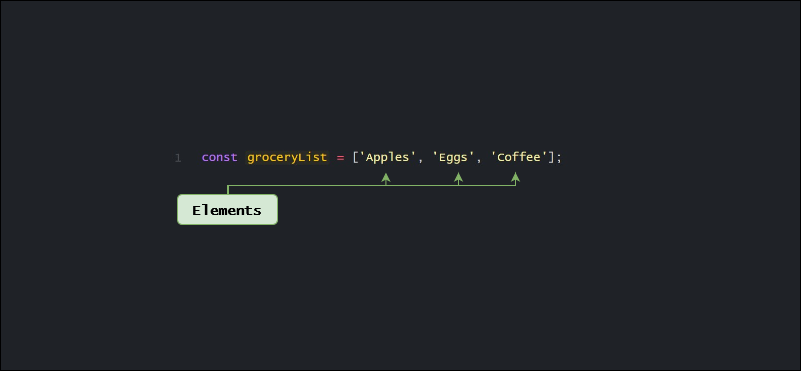
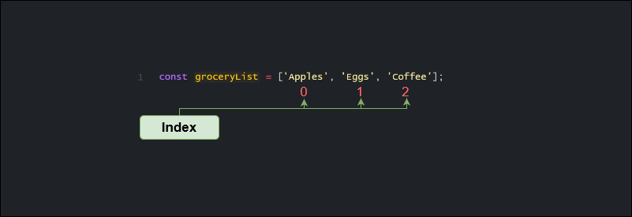
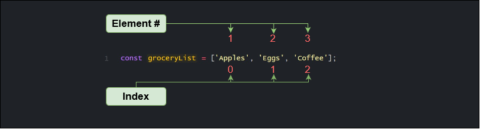

One of the most fundamental operations in programming is storing and organizing data. To help effectively manage data, we can organize it into lists. We organize data all the time in day-to-day life by creating lists. For example we might create a grocery list that looks like this:

**Grocery List:**

1. Apples
2. Eggs
3. Coffee

Now that we have written down or stored the grocery items in a list, we can refer to it later. We can add or remove items on the list, update them or reorganize them in a way that better serves our needs.

In programming, we can do the same thing. We can create lists, organize and modify them to fit our needs. In JavaScript, arrays are used to make lists. Arrays are [indexed collections](https://www.ecma-international.org/ecma-262/#sec-indexed-collections) that come with some great methods to help us organize data.

Let's see the grocery list above written in JavaScript:

```javascript
const groceryList = ["Apples", "Eggs", "Coffee"]
```

In the example above the items from the grocery list are stored as `strings` inside the array. The array is then stored in the variable `groceryList`, allowing us to access multiple values from one variable. Arrays are capable of holding different types of data such as `strings`, `booleans`, `numbers` and `objects`.

Items that are held in an array are called elements.


The array in the diagram above, contains three elements. The number of elements in the array is equal to the arrays length.

```javascript
// this element has 3 elements
const groceryList = ["Apples", "Eggs", "Coffee"]
console.log(groceryList.length) // Output: 3
```

In addition to holding different types of elements, arrays do not have a fixed length. Additional elements can be added or removed at any time, the number of elements or the

```javascript
// arrays are not fixed length
const groceryList = ["Apples", "Eggs", "Coffee", "Flour", "Salt", "Bread"]
```

## Creating an array

In JavaScript, there is more than one way to create an array. Let's have a look at one of the most common ways, which is using an [array literal](https://www.ecma-international.org/ecma-262/#prod-ArrayLiteral).

**Array literal**

To create an array using an array literal, wrap the items in square brackets `[]`.

```javascript
;["Apples", 15, 20, false]
```

Let's describe what's happening above:

- An array is implicitly created by wrapping square brackets `[]` around the items.
- The items inside an array are called elements
- The elements in the array are different data types, `string`, `number` and `boolean`

We can save an array to a variable.

```javascript
const myFirstArray = ["Apples", 15, 20, false]
console.log(myFirstArray) // Output: ['Apples', 15, 20, false]
```

> Elements inside of an array are mutable

Arrays that are declared using the `const` keyword can still have its elements modified, they remain mutable. You can't reassign the the variable, but the contents of the array can be manipulated.

**Array constructor**
Another way to create an array is with the [`Array()` constructor](https://developer.mozilla.org/en-US/docs/Web/JavaScript/Reference/Global_Objects/Array/Array) and the [`new`](https://developer.mozilla.org/en-US/docs/Web/JavaScript/Reference/Operators/new) operator. Since an array is a built-in object in JavaScript, we can create an instance of an array using the `new` operator and the array constructor function.

```javascript
const myArray = new Array()
console.log(myArray) // Output: [];
```

This method of creating an array is not as common, mainly due to performance issues but there are other differences to be aware of.

One major difference is how the array constructor handles a number as an argument:

```javascript
// these are the same
const array1 = []
const array2 = new Array()

// these are the same
const array3 = ["element"]
const array4 = new Array("element")

// these are different
const array5 = [5]
const array6 = new Array(5)
console.log(array6) // Output: [undefined, undefined, undefined, undefined, undefined,]
```

As you can see when the only argument to the constructor is an integer, the arrays length property will be set to that number.

If you're interested in diving deeper into the differences check out this [thread on Stack Overflow](https://stackoverflow.com/questions/931872/what-s-the-difference-between-array-and-while-declaring-a-javascript-ar/931875#931875) which does a good job explaining them.

## Accessing array elements

Now that we've learned how to create an array, let's look at how we can access elements in an array.

**Bracket notation**

Arrays are ordered lists, each element has a specific position in the array. Every position has a corresponding number known as the index which can be used to access that element.



You'll notice that the first element in the array (Apples) has an index of `0`. This is because they are zero-indexed, meaning that the count starts at `0`. This can lead to many "off by one" errors when you're starting out because it's easy to forget.

The first element in an array will have an index position of `0`.



The index position can be used to access array elements. For example if we wanted to log the element `Eggs`, all we need to know is its index position.

```javascript
// 'Eggs' has index position 1
const groceryList = ["Apples", "Eggs", "Coffee"]
console.log(grocerList[1]) // Output: Eggs
```

Above, the index position of `Eggs` is `1`, we can then pass that index number into square brackets after the name of the array to access that value.

Here are a couple of more examples of accessing array items via bracket notation:

```javascript
const animals = ["lion", "tiger", "rabbit"]
let secondElement = animals[1] // tiger
let lastElement = animals[animals.length - 1] // rabbit
```

**Looping**

With bracket notation we were able to access individual items using the index number. What if we wanted to access every item in an array? Well we could use another fundamental programming concept called [looping](https://developer.mozilla.org/en-US/docs/Learn/JavaScript/Building_blocks/Looping_code).

For example we could use a [`for`](https://developer.mozilla.org/en-US/docs/Web/JavaScript/Reference/Statements/for) loop to access the items in an array.

```javascript
const arrayOfNumbers = [1, 2]
for (let i = 0; i < arrayOfNumbers.length; i++) {
  console.log(arrayOfNumbers[i])
}
// Output: 1
// Output: 2
```

Let's have a look at the syntax above. The loop counter will increase by 1 as long as `i` is less than `arrayOfNumbers.length`. For every iteration we log value of the array item by taking advantage of bracket notation.

Here's the same example using the [`for...of`](https://developer.mozilla.org/en-US/docs/Web/JavaScript/Reference/Statements/for...of) loop:

```javascript
for (let num of arrayOfNumbers) {
  console.log(num)
}
// Output: 1
// Output: 2
```

In addition to the `for` loops, the built-in array object has a number of powerful methods to iterate over arrays that we can take advantage of.

```javascript
arrayOfNumbers.forEach(num => console.log(num))
// Output: 1
// Output: 2
```

In just one line of code, we can achieve the same results using the built-in [`forEach()`](https://developer.mozilla.org/en-US/docs/Web/JavaScript/Reference/Global_Objects/Array/forEach) method.

## Updating array elements

Another basic operation when working with arrays is **updating elements**. This can be accomplished by using bracket notation and the index number of the element to be updated.

```javascript
let fruit = ["Apples", "Lettuce", "Pear"]
fruit[1] = "Orange"

console.log(fruit) // Output: ['Apples', 'Orange', 'Pear']
```

> Remember that arrays are zero-indexed, the last elements index number is equal to the array length - 1.

Update the last element in an array.

```javascript
let fruit = ["Apples", "Orange", "Pear"]
fruit[fruit.length - 1] = "Grape"
```

Using the `forEach()` method to modify an array:

```javascript
let fruit = ["Apples", "Lettuce", "Pear"]
fruit.forEach((curr, index) =>
  curr === "Lettuce" ? (fruit[index] = "Orange") : curr
)

// Output: ["Apples", "Orange", "Pear"];
```

In the example above, we iterate over the `fruit` array using the `forEach()` method. Then a [ternary operator](https://developer.mozilla.org/en-US/docs/Web/JavaScript/Reference/Operators/Conditional_Operator) checks if the current element in the array is equal to `Lettuce`, if it is then it will replace that element with `Orange`. If the element is not equal to `Lettuce` then the element is not modified.

## Adding elements to an array

Another built-in method on the array object is [`.push()`](https://developer.mozilla.org/en-US/docs/Web/JavaScript/Reference/Global_Objects/Array/push). This method adds one or more items to the end of an array

```javascript
let fruit = ["Apples", "Orange", "Pear"]
fruit.push("Banana", "Grape")
console.log(fruit) // Output: ["Apples", "Lettuce", "Pear", "Banana", "Grape"]
```

[`.unshift()`](https://developer.mozilla.org/en-US/docs/Web/JavaScript/Reference/Global_Objects/Array/unshift) will add one or more elements to the beginning of an array:

```javascript
let fruit = ["Apples", "Orange", "Pear"]
fruit.unshift("Banana", "Grape")
console.log(fruit) // Output: ["Banana", "Grape", "Apples", "Orange", "Pear"]
```

## Removing elements from an array

Elements can also easily be removed from an array.

The `.shift()` method can be used to remove the first element in an array.

```javascript
let fruit = ["Apples", "Orange", "Pear"]
fruit.shift()
console.log(fruit) // Output: ["Orange", "Pear"]
```

And `.pop()` will remove the last element from an array.

```javascript
let fruit = ["Apples", "Orange", "Pear"]
fruit.pop()
console.log(fruit) // Output: ["Apples", "Orange"]
```

## Array methods

As we've seen, arrays have several built-in methods that can be used when working with arrays. Take some time to familiarize yourself with these methods and how they work.

Here are just a few commonly used array methods:

- [`.join()`](https://developer.mozilla.org/en-US/docs/Web/JavaScript/Reference/Global_Objects/Array/join)
- [`.slice()`](https://developer.mozilla.org/en-US/docs/Web/JavaScript/Reference/Global_Objects/Array/slice)
- [`.splice()`](https://developer.mozilla.org/en-US/docs/Web/JavaScript/Reference/Global_Objects/Array/splice)
- [`.shift()`](https://developer.mozilla.org/en-US/docs/Web/JavaScript/Reference/Global_Objects/Array/shift)
- [`.unshift()`](https://developer.mozilla.org/en-US/docs/Web/JavaScript/Reference/Global_Objects/Array/unshift)
- [`.concat()`](https://developer.mozilla.org/en-US/docs/Web/JavaScript/Reference/Global_Objects/Array/unshift)
- [`.map()`](https://developer.mozilla.org/en-US/docs/Web/JavaScript/Reference/Global_Objects/Array/map)
- [`.reduce()`](https://developer.mozilla.org/en-US/docs/Web/JavaScript/Reference/Global_Objects/Array/Reduce)
- [`.forEach()`](https://developer.mozilla.org/en-US/docs/Web/JavaScript/Reference/Global_Objects/Array/forEach)

Here's an example of how you might recieve some data and how you can use `.reduce()` method to organize and store it in a helpul way.

```javascript
let members = [
  {
    name: "Joe",
    clubs: ["Frisbee", "Chess"],
    active: true,
  },
  {
    name: "Wendy",
    clubs: ["Running", "Python"],
    active: true,
  },
  {
    name: "Roger",
    clubs: ["Volleyball"],
    active: true,
  },
]

let allClubs = members.reduce((acc, curr) => {
  return [...acc, ...curr.clubs]
}, [])

console.log(allClubs)
// Output: ["Frisbee", "Chess", "Running", "Python", "Volleyball"]
```

Having a closer look at the code above, we can see that `members` is an array. Each element in the `members` array is an object. One of the objects properties is an array called `clubs` that contains the various clubs the members are in.

Here the `reduce()` method is used to flatten the arrays. It iterates over the `members` array returns a new array that contains all the members clubs.

## Wrap up

Working with lists of data is a fundamental skill in programming. In JavaScript we can create lists using arrays. In this article we learned how to create an array, add, remove and update elements and we looked at some of the commonly used, built-in array methods.

## Further reference

- [Array Index - ECMA](https://www.ecma-international.org/ecma-262/#array-index)
- [Array Literal - ECMA](https://www.ecma-international.org/ecma-262/#prod-ArrayLiteral)
- [Indexed Collection - ECMA](https://www.ecma-international.org/ecma-262/#sec-indexed-collections)
- [Difference between array constructor and array literal - Stack Overflow](https://stackoverflow.com/questions/931872/what-s-the-difference-between-array-and-while-declaring-a-javascript-ar/931875#931875)
- [push() method - MDN Reference](https://developer.mozilla.org/en-US/docs/Web/JavaScript/Reference/Global_Objects/Array/push)
- [Array - MDN Reference](https://developer.mozilla.org/en-US/docs/Web/JavaScript/Reference/Global_Objects/Array)
- [Array() Constructor - MDN Reference](https://developer.mozilla.org/en-US/docs/Web/JavaScript/Reference/Global_Objects/Array/Array)
- [new operator - MDN](https://developer.mozilla.org/en-US/docs/Web/JavaScript/Reference/Operators/new)
- [for...of loop - MDN Reference](https://developer.mozilla.org/en-US/docs/Web/JavaScript/Reference/Statements/for...of)
- [forEach() method - MDN Reference](https://developer.mozilla.org/en-US/docs/Web/JavaScript/Reference/Global_Objects/Array/forEach)
