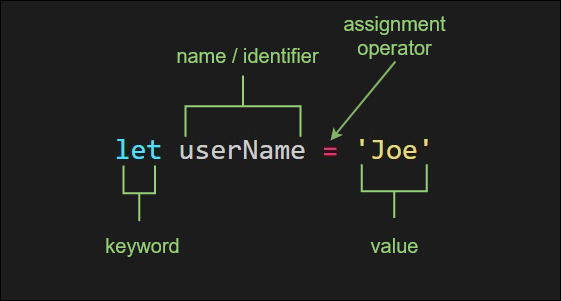

You can think of variables as containers of information. Variables allow a way of labeling data with a descriptive name. They are not values themselves, but they contain values and represent them with a name.

You can assign different kinds of values to variables, such as strings, arrays and objects.

```javascript
const color = "blue"
const counter = 10
const names = ["Joe", "Alice", "Frank"]
const engine = {
  size: 600,
  mileage: 1300,
  operating: true,
}
```

## Declaring a variable

Variables are declared using one of three keywords in JavaScript `var`, `let` and `const`. Prior to ECMAScript 2015 `var` was used to declare all variables.

```javascript
var fruit = "Banana"
const firstNames = ["Joe", "Jessica", "Alice"]
let counter = 0
```

Many new programs will only use `let` and `const` but `var` is still out there.

Let's have a closer look at a variable declaration.

```javascript
let userName = "Joe"
```

In the example above, a variable called `userName` has been declared using the `let` keyword, it has been assigned a value of `Joe`.



- `let` keyword declares a new variable.
- `userName` is the variable name, or identifier.
- `=` the assignment operator assigns the value to the variable.
- `Joe` is the value that the variable was initialized with.

You can also use destructuring assignment syntax to create a variable and assign value from object literals.

```javascript
const engine = {
  size: 600,
  mileage: 1300,
  operatingStatus: true,
}

// creates a variable named size
// assigns size value equal to engine.size
const { size } = engine

console.log(`engine size: ${size}`) // Output: engine size: 600
```

Above we unpack the name and value of the engine objects `size` property.

Now that we've seen how easy it is to get started, let's have a closer look at naming JavaScript variables.

## Naming variables

When considering a name, it's important that it is relatively descriptive and easy to read. In contrast to variables in mathematics, variable names in JavaScript programs are usually choosen based on readability and descriptiveness .

Camel casing is also a common convention used in JavaScript programs.

```javascript
const userSelectedItems = {}
```

Variable names are called identifiers. Identifiers are sequences of characters that are used to identify a variable, function or property.

JavaScript identifiers

- Are case-sensitive
- Must start with a letter, `$` or `_`
- Can contain Unicode letters
- Can contain digits (0-9), but cannot start with a digit
- Can contain `$` and `_`

These identifiers are all acceptable:

```javascript
const $one_name = "Jane"
const Status_Number = 5
let _speed10 // _underscore is sometimes used to indicate private vars
```

You can also use Unicode letters and Unicode escapes sequences.

```javascript
let \u0636 = [1, 2, 5];

const exampleChar\u0E16 = "Thai"
console.log(exampleCharถ) // Output: Thai
console.log(\u0636) // Ouput: [1, 2, 5]
```

Although the variable names above are allowed, you'll generally try and choose variable names that are descriptive and therefor easy to read. Conventions like camel casing are followed to help readability.

These are good examples ✅

```javascript
// these are good names
let userName = "Joe"
let userEmail = "joe@example.com"
```

Although variable names are case sensitive, don't create multiples that share the same name but have different casing.

This would be considered bad practice 🚫

```javascript
// don't do this
const exampleFruit = "Orange"
const examplefruit = "Banana"
```

Variable names cannot use [reserved keywords](https://developer.mozilla.org/en-US/docs/Web/JavaScript/Reference/Lexical_grammar#Keywords). Watch out for keywords like `new`, `with`, `this` these are reserved. You'll likely get a `SyntaxError` if you attempt to use these.

While that was a lot of information about naming variables, the overall goal should be creating variable names that are descriptive and easy to read. If you have a clear reason to steer away from common practice then try and be consistent in your choices.

## Variable scope

An important difference between JavaScript and other languages like Java, is that in JavaScript, blocks do not have scope, only functions have a scope. So if a variable is defined using `var` in a compound statement (for example inside an `if` control structure), it will be visible to the entire function. However, starting with ECMAScript 2015, `let` and `const` declarations allow you to create block-scoped variables. Let's have a closer look at this.

If you declare a variable outside of any function, it is known as a _global_ variable, when you declare a variable inside of a function it is called a _local_ variable. Local variables are available within the function they are declared.

```javascript
var y // Global variable
function example() {
  var speak = "Hello" // Local variable
}
```

Global variables are properties of the global object. You can see this by opening a browser console and creating a global variable, then access the variable through the window object. The window object is the global object in the browser.

```javascript
var globalNum = 10
window.globalNum // Output: 10
```

Prior to ECMAScript 2015 and the `let` and `const` keywords, JavaScript didn't have block statement scope. So a variable declared inside a block is local to the scope that the block is in.

```javascript
function example() {
  var speak = "Hello"
  if (true) {
    var num = 5
  }
  console.log(num) // Ouput: 5; no block scope
}
```

When using the `let` or `const` keywords to declare a variable, it will be block-scoped. That means it is only available in the scope of the containing block.

```javascript
function example() {
  var speak = "Hello"
  if (true) {
    let num = 5
  }
  console.log(num) // Output: ReferenceError: num is not defined
}
```

## `let` keyword

`let` keyword allows you to reassign the variable to a different value

```javascript
let color = "red"
console.log(color) // Output: red
color = "blue"
console.log(color) // Output: blue
```

The `let` keyword declares block level variables. The declared variable is available from the block it's enclosed in as well as sub-blocks.

```javascript
const myFunction = () => {
  let x = 1
  {
    let x = 2
    console.log(x) // Output: 2
  }
  console.log(x) // Output: 1
}
myFunction()
```

We can also declare a variable without assigning it a value. In this case the variable will be initialized with a value of `undefined`

```javascript
let pizza
console.log(pizza) // Output: undefined
pizza = "Cheese"
console.log(pizza) // Output: Cheese
```

## `const` keyword

`const` allows you to declare variables whose values are not meant to change. The variable is available from the block its declared in.

```javascript
const myBirthday = "1990-11-02"
```

A variable declared with the `const` keyword cannot be reassigned. They are meaned to stay constant and attempting to reassign them will cause a [`TypeError`](https://developer.mozilla.org/en-US/docs/Web/JavaScript/Reference/Errors/Invalid_const_assignment)

```javascript
const fruit = "Orange"
fruit = "Banana" // Output: TypeError
```

You'll see a `TypeError` like this in the console:

```shell
Uncaught TypeError: invalid assignment to const 'fruit'
	fruit = 'Banana';
       ^

TypeError: Assignment to constant variable.
```

`const` variables must be assigned a value when first declared. If not declared with a value, it will result in a `SyntaxError`

```javascript
const animals; // Ouput: SyntaxError
```

## Wrap up

Wow, that was a lot of information about JavaScript variables. But now you should have a pretty good understanding of JavaScript variables and how to use them. Remember that variables are not values themselves, `let` and `const` are block-scoped, watch out for reserved keywords and choose descriptive and easy to read names.

## Further reference

[var - MDN](https://developer.mozilla.org/en-US/docs/Web/JavaScript/Reference/Statements/var#Description)
