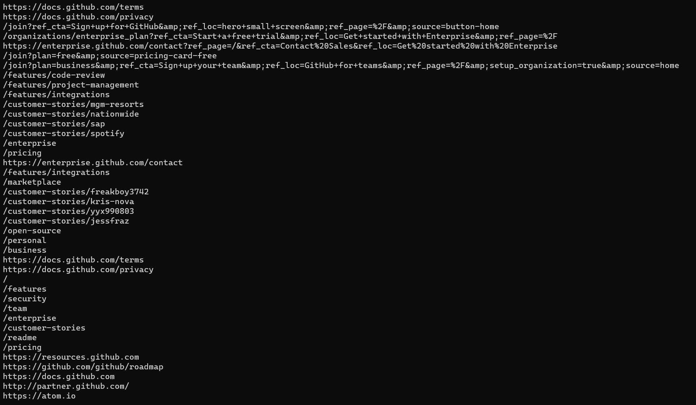

import { Link } from "gatsby"

In this post I'll show you how to make server requests using PowerShell cmdlets. While you can use `curl` directly from Cmd or PowerShell in
Windows 10 this article will focus on using PowerShell cmdlets [`Invoke-WebRequest`](https://docs.microsoft.com/en-us/powershell/module/Microsoft.PowerShell.Utility/Invoke-WebRequest?view=powershell-7#examples)
and [`Invoke-RestMethod`](https://docs.microsoft.com/en-us/powershell/module/microsoft.powershell.utility/invoke-restmethod?view=powershell-7) and not the
differences between `curl`.

Make sure to check out my <Link to={"/powershell-for-devs"}>PowerShell for developers</Link> crash course if you'd like to refresh on some of the basics.

### Requesting Data from a REST API

Let's first have a look at how we can get data from an API using `Invoke-WebRequest`. I'll be using
the [jsonplaceholder site](https://jsonplaceholder.typicode.com/) as an example to get started.

You can use `Invoke-WebRequest` to make HTTP or HTTPS requests. Simply provide a value to the `-Uri` parameter.

```powershell
# these are the same
Invoke-WebRequest -Uri "https://jsonplaceholder.typicode.com/users/1"
Invoke-WebRequest "https://jsonplaceholder.typicode.com/users/1"
```

Here is the response:

```
StatusCode        : 200
StatusDescription : OK
Content           : {
                      "id": 1,
                      "name": "Leanne Graham",
                      "username": "Bret",
                      "email": "Sincere@april.biz",
                      "address": {
                        "street": "Kulas Light",
                        "suite": "Apt. 556",
                        "city": "Gwenborough",
                        "zipco…
                    }
RawContent        : HTTP/1.1 200 OK
                    Date: Fri, 28 Aug 2020 22:45:18 GMT
                    Connection: keep-alive
Headers           : {[Date, System.String[]], [Connection, System.String[]], [Set-Cookie, System.String[]], [X-Powered-By, System.String[]]…}
Images            : {}
InputFields       : {}
Links             : {}
RawContentLength  : 509
RelationLink      : {}
```

That was pretty simple right? All we had to do was specify a `-Uri` parameter value and `Invoke-WebRequest` requested the data and performed some
basic parsing of the response. You'll see we not only get the actual content of the web page but also the associated metadata.

Because PowerShell natively parses the response data, if you wanted to see a single response property you could do something like this:

```powershell
# this will only diplay the content of response
(Invoke-WebRequest "https://jsonplaceholder.typicode.com/users/1").Content
```

You'll notice how the command and `-Uri` parameter are enclosed in parentheses () which allows you to access the objects properties
using dot notation.

Now let's request the same data using the `Invoke-RestMethod` cmdlet.

```powershell
Invoke-RestMethod "https://jsonplaceholder.typicode.com/users/1"
```

Here's the response:

```
id       : 1
name     : Leanne Graham
username : Bret
email    : Sincere@april.biz
address  : @{street=Kulas Light; suite=Apt. 556; city=Gwenborough; zipcode=92998-3874; geo=}
phone    : 1-770-736-8031 x56442
website  : hildegard.org
company  : @{name=Romaguera-Crona; catchPhrase=Multi-layered client-server neural-net; bs=harness real-time e-markets}
```

Notice how the response has been automatically converted from JSON to a PowerShell object and does not include the metadata.
The biggest difference between `Invoke-WebRequest` is that `Invoke-RestMethod` automatically converts JSON and XML response data into PowerShell objects, while `Invoke-WebRequest`
is best for handling HTML data.

Check out [this article](https://www.systemcenterautomation.com/2018/05/invoke-restmethod-vs-invoke-webrequest/) by Billy York which goes deeper into the differences.

### Saving the response body to a file

You can easily save the response body to a specified file by using the `-Outfile` parameter. In this example we'll save the data to a file
called `output.json`. PowerShell will create this file in the current location if it does not already exist.

```powershell
# the -Outfile paramter is available on both cmdlets
Invoke-RestMethod "https://jsonplaceholder.typicode.com/users/1" -Outfile output.json
Invoke-WebRequest "https://jsonplaceholder.typicode.com/users/1" -Outfile output.json
```

### Making a POST request

Here's how you can make a POST request using `Invoke-RestMethod`. You can also use `Invoke-WebRequest` but for the following examples we'll
be using `Invoke-RestMethod`.

In this examples you'll be using a couple of variables in this command. One called `$url` which will stores endpoint and another called `$Body` which
will store the body of the POST request.

```powershell
$url = "https://jsonplaceholder.typicode.com/posts"
$Body = @{
    id = 1
    userId = 1
    title = "sending a POST request"
    body = "Lorem ipsum dolor sit amet, consectetur"
}
Invoke-RestMethod -Method "Post" -Uri $url -Body $Body
```

By default both `Invoke-RestMethod` and `Invoke-WebRequest` set the content type of the body to `application/x-www-form-urlencoded`. You can
easily specify a different content type like this:

```powershell
## continuing the example above
Invoke-RestMethod -Method "Post" -Uri $url -Body $Body -ContentType application/json
```

### Scrape links off a web page

`Invoke-WebRequest` makes it really easy to extract all the links from a web page. Because this cmdlet automatically parses the HTML all we need
to do is indicate we only want the `<a>` tags from the page. Notice again that the cmdlet and paramter are wrapped in parentheses.

We'll use the [GitHub](https://github.com/) homepage as an example.

```powershell
(Invoke-WebRequest "https://github.com/").Links.Href
```



### Tracking GitHub issues

In this example we'll be using the GitHub API and the `Invoke-RestMethod` cmdlet to list all the open issues for the `React-Native` repository. Taking it a bit further
you could also filter the results to your specific needs, perhaps you're only interested in seeing open issues that contain specific keywords.

First we can get a list of all the endpoint categories that their REST API supports.

```powershell
# this will return a list of available endpoints
Invoke-RestMethod "https://api.github.com"
```

The one that should fit our needs is `https://api.github.com/repos/{owner}/{repo}`. The owner is `facebook` and the repo is `react-native`,
we'll also be querying for any open issues.

```powershell
$url = "https://api.github.com/repos/facebook/react-native/issues?state=open"
$site = Invoke-RestMethod $url
```

Now that you have a list of open issues you can refine the results even further. In this example let's only extract results that
contain the keyword `iOS`. You can use the [`-Match`](https://docs.microsoft.com/en-us/powershell/module/microsoft.powershell.core/about/about_comparison_operators?view=powershell-7) comparison operator
to search for matches.

```powershell
# our keyword will be iOS
$keyword = 'ios'
$site -Match $keyword
```

We'll go ahead and save all the matching results in a variable named `$AllMatches`.

```powershell
$AllMatches = $site -Match $keyword
```

Now we can use dot notation to access the specific object properties you might need.

```powershell
# list all the titles from the search
$AllMatches.title
```

Here we see all titles of all the open issues that contain our defined `keyword`:

```
Local images not rendered on iOS physical device for release build
Metro-bundler error: Module `@babel/runtime/helpers/interopRequireDefault` does not exist in the Haste module map
Change ScrollView.scrollIndicatorInsets to not automatically add safe area on iOS 13
Bug in TextInput's text style in android, when the text's style in changed conditionally
false trackColor prop does not work for Switch component on iOS
Fix duplicate accessibilityLabels on iOS
Double slashes instead of tripple
React-Native "react-native": "0.62.2" is not working on Android - 9.
iOS use_frameworks! broken in v0.63.2
iOS Linking getInitialURL() Cannot read, copy or use the file in the url
Update Flipper
Cannot animate shadowOffset
```

Perhaps it would be helpful to have the `title` and `created_at` properties written to a file so we can email them or add them to
a database. You can iterate over `$AllMatches` and extract specific properties that can then be saved to a file.

```powershell
$IssueList =  forEach($item in $AllMatches) { Write-Output $item.created_at, $item.title}
$IssuesList | Out-File -Path .\IssueReport.txt
```

You could continue with this example and begin to automate the request to update daily, email a team member or really anything that might
be helpful to monitor issues.

## Wrap up

In this we saw how we can use `Invoke-WebRequest` and `Invoke-RestMethod` to make server requests, including POST requests. As well as
extract links from a web page and interact with the GitHub API to track issues with a specific repository and search keyword.

There are many many more options, scenarios and concepts about server requests, parsing and `Invoke-WebRequest` and `Invoke-RestMethod` that
were not mentioned here so make sure to have a look at the official [docs](https://docs.microsoft.com/en-us/powershell/module/microsoft.powershell.utility/invoke-webrequest?view=powershell-5.1)
to learn more.
