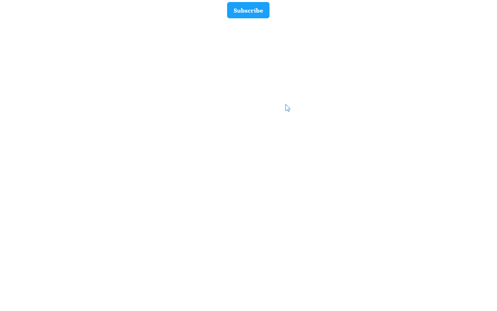
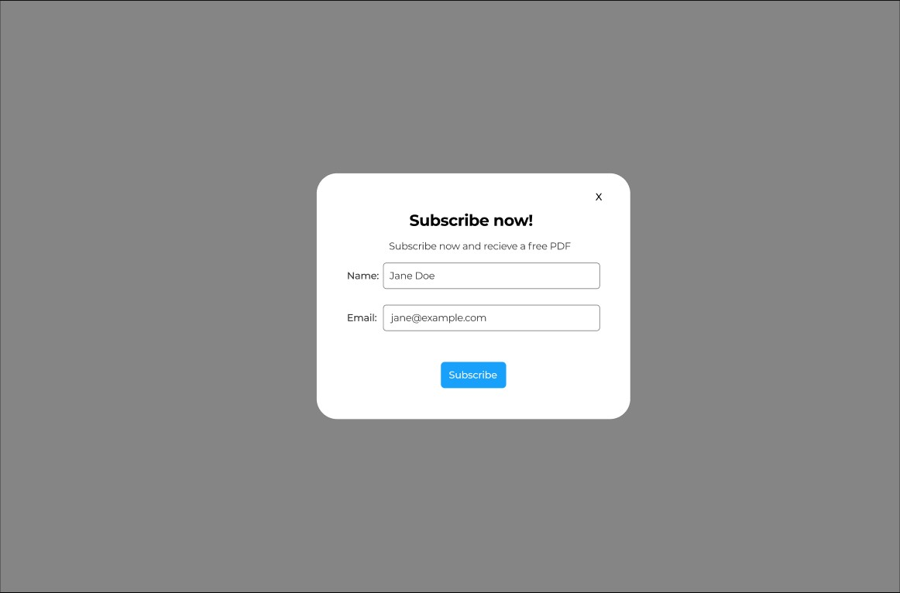
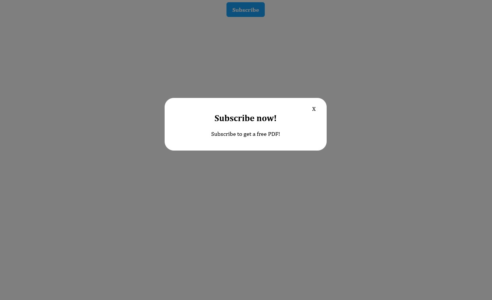
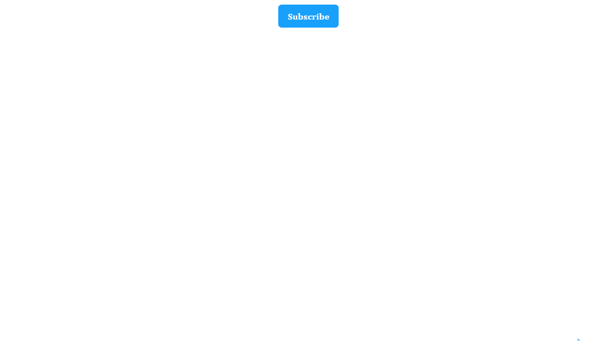

One common feature in many web pages and apps are modals. Modal windows and overlays serve as structural elements for many differenet types of content, such as images and videos, forms, alerts and notices and others like search boxes. Becoming familiar with modals and the various ways they can be created is a great way to practice your skills as a front-end developer and has been known to be included during interviews.

In this article we'll create a simple modal overlay that contains a newsletter sign-up form, using HTML, CSS and JavaScript.

## Goal

We have a web page and we need to collect email addresses for a newsletter. To do this we will create a dismissible modal overlay. A user should be able to click on a "Subscribe" button which will open the modal overlay that will contain a basic sign up form. The sign up form will collect a users name and email address. If the user successfully submits the form a success message will briefly appear.

Here's what the final product will look like:



And here's a link to the final source code on [CodePen](https://codepen.io/aaronsonish/pen/dyXaxOL).

The user should be able to dismiss the modal by clicking an "X" or clicking anywhere outide of the modal.

Let's break these requirements down further:

1. Create "Subscribe" button
   - User can click button and enable the modal.
2. Create modal overlay
   - Must be centered vertically and horizontally.
   - The modal will contain a CTA and a form.
3. Modal contains form to collect name and email
4. User can submit the form
5. User can dismiss the modal
   - User can click "x" button to dismiss.
   - User can click anywhere outside of the modal to dismiss
6. When a form is submitted, the modal is closed and a "Success" message is shown.

Here's a mockup of the form:



## Getting started

Let's start off by creating a "Subscribe" button that the user can click, as well as the basic structure of our modal.

```html
<div>
  <button>Subscribe</button>
  <!-- modal overlay -->
  <div class="modal-overlay">
    <div class="modal">
      <div class="modal-close">X</div>
      <div class="modal-content">
        <h2>Subscribe now!</h2>
        <p>Subscribe to get a free PDF!</p>
      </div>
    </div>
  </div>
</div>
```

After the button, we can create the structure of the modal. It is made up of two main elements, the `div` with the class name `modal-overlay` and then the modal itself which is composed of a `div` with the class name `modal` and it's children.

The `modal-overlay` will encompass the entire viewport when enabled, and showcase the modal. We will add some styling to the overlay to focus the users attention on the modal itself.

Currently we have a button and a bit of content but it looks awful and the user can't interact with it as intended. We'll have to add a bit of JavaScript and CSS in the next step.


Let's add some styles to the button and modal. Remember, we want the modal to be hidden unless a user activates the "Subscribe" button.

```css
* {
  font-family: Cambria, Cochin, Georgia, Times, "Times New Roman", serif;
}

button {
  order: 1;
  display: block;
  margin: 0 auto;
  align-content: center;
  border: none;
  cursor: pointer;
  height: 2.5rem;
  min-width: 2.5rem;
  background-color: #18a0fb;
  color: rgb(255, 255, 255);
  font-size: 1rem;
  padding-left: 1rem;
  padding-right: 1rem;
  font-weight: 600;
  border-radius: 6px;
}

.modal-wrapper {
  background: rgba(0, 0, 0, 0.5);
  position: fixed;
  top: 0;
  left: 0;
  width: 100%;
  height: 100%;
  display: none;
}

.modal {
  font-family: Arial;
  width: 100%;
  max-width: 400px;
  margin: 20% auto;
  padding: 20px;
  background-color: white;
  position: relative;
  border-radius: 25px;
}

.modal-content {
  text-align: center;
}

.modal-close {
  position: absolute;
  top: 20px;
  right: 30px;
  cursor: pointer;
  color: black;
}
```

Overall some basic styles but a couple of things to notice. The class `modal-wrapper` is an important piece as this is the main overlay. It covers the entire viewport and is not displayed by default. The `background` color has also been set to a gray color with very low opacity, this will dim the other page elements and allow the focus to remain on the modal content.

## Activating the modal

Let's complete the "Subscribe" button functionality. Remember, when a user activates the button the modal overlay should appear. We'll use JavaScript to accomplish this.

```javascript
const buttonEl = document.querySelector("button")
const wrapper = document.querySelector(".modal-wrapper")

buttonEl.addEventListener("click", () => {
  wrapper.style.display = "block"
})
```

First we get a reference to the button element and the `div` with a class name of `modal-wrapper` by and save those to variables called `buttonEl` and `wrapper`. Then we attach an event listener to the `buttonEl` that listens for a "click" event. Everytime the `buttonEl` is clicked we set the `display` property to `block` which then reveals the `div` element with the class name of `modal-wrapper`.



## Dismiss the modal

Okay, great! We've already completed half of the requirements. We have a working "Subscribe" button that activates the modal overlay. However, right now there is no way for a user to dismiss the modal.

There are two ways in which the user should be able to dismiss the modal:

1. User clicks the "X"
2. User clicks anywhere outside the modal

Let's implement these now.

```javascript
const buttonEl = document.querySelector("button")
const wrapper = document.querySelector(".modal-wrapper")
const closeEl = document.querySelector(".modal-close") // highlight-line

buttonEl.addEventListener("click", () => {
  wrapper.style.display = "Block"
})

// highlight-start
closeEl.addEventListener("click", () => {
  wrapper.style.display = "none"
})
// highlight-end

// highlight-start
wrapper.addEventListener("click", e => {
  if (e.target.className === "modal-wrapper") {
    wrapper.style.display = "none"
  }
})
// highlight-end
```

First we store a reference to the "X" in a variable called `closeEl`. Then we add an event listener that listens for a click, when a user clicks the `closeEl` then the `display` property on the `wrapper` will be set to `none` and the modal will close.

Then we also add an event listener to the `wrapper` itself. Because the `wrapper` covers the entire viewport other than the modal content itself, we close the modal when the user clicks anywhere that the class name equals `modal-wrapper`.

Let's try this out now.



## Add sign-up form

Now that we have the basic structure and functionality of the modal working, let's go ahead and add the form to the modal. This will collect the users name and email.

Let's add the form inside the `div` with the class name of `modal-content`:

```html
<div class="modal-wrapper">
  <div class="modal">
    <div class="modal-close">X</div>
    <div class="modal-content">
      <h2>Subscribe now!</h2>
      <p>Subscribe to get a free PDF!</p>
      <form>
        <p>
          <label
            >Name:
            <input name="name" placeholder="Jane Doe" type="text" required
          /></label>
        </p>
        <p>
          <label
            >Email:
            <input
              placeholder="jane@example.com"
              type="email"
              name="custemail"
              required
          /></label>
        </p>
        <p><button type="submit">Subscribe</button></p>
      </form>
    </div>
  </div>
</div>
```

As you can see it's a basic form with two `input` elements and a `button` to submit the form. Input validation can easily be added via HTML or JavaScript depending on your requirements, however for this example we'll leave things how they are. If you're interested in learning more about form validation, check out my article on [client-side form validation](/client-side-validation-using-built-in-form-validation/).

Let's add some more styles so the form looks a bit closer to the mockup.

```css
form > p > button {
  margin-top: 1rem;
  height: 2.5rem;
  min-width: 2.5rem;
  background-color: #18a0fb;
  color: rgb(255, 255, 255);
  font-size: 1rem;
  padding-left: 1rem;
  padding-right: 1rem;
  font-weight: 600;
  border-radius: 6px;
}

p > label {
  font-size: 1rem;
  padding-bottom: 6px;
  opacity: 1;
  font-weight: 500;
  text-align: left;
  line-height: 1.25;
  display: block;
  border-width: 0px;
  border-style: solid;
  border-color: rgb(226, 232, 240);
}

input[type="text"],
input[type="email"],
fieldset {
  width: 80%;
  border: 1px solid #333;
  box-sizing: border-box;
  font-size: 1rem;
  padding-left: 0.5rem;
  padding-right: 1rem;
  height: 2.5rem;
  border-radius: 0.25rem;
  border-style: solid;
  border-color: inherit;
  background-color: rgb(255, 255, 255);
}
```

## Success message

When a user enters thier information into the form and clicks the submit button, it would be nice to show some sort of visual confirmation.

Here's what we want to do:

1. User clicks "submit" button
2. Modal closes
3. Message temporarily appears indicating successful submission.

First, let's create the HTML we need for the success message, we'll put this right after the `modal-overlay`.

```html
<div class="success-wrapper">
  <div>
    <p>Success! Thank you for subscribing to the newletter 🙏</p>
  </div>
</div>
```

And we'll add a few basic styles:

```css
.success-wrapper {
  display: none;
  border-radius: 6px;
  background-color: #33ce34c9;
  max-width: 400px;
  margin: 45vh auto;
```

The success message will be hidden by default because of the `display` property being set to `none`. The message is roughly centered vertically and horizontally.

Now, we can add the functionality by controlling what happens when the form is submitted.

```javascript
const buttonEl = document.querySelector("button")
const wrapper = document.querySelector(".modal-wrapper")
const closeEl = document.querySelector(".modal-close")
const form = document.querySelector("form") // highlight-line
const successEl = document.querySelector(".success-wrapper") // highlight-line

buttonEl.addEventListener("click", () => {
  wrapper.style.display = "Block"
})

closeEl.addEventListener("click", () => {
  wrapper.style.display = "none"
})

wrapper.addEventListener("click", e => {
  if (e.target.className === "modal-wrapper") {
    wrapper.style.display = "none"
  }
})
// highlight-start
form.addEventListener("submit", e => {
  e.preventDefault()
  wrapper.style.display = "none"
  successEl.style.display = "block"
  setTimeout(() => {
    successEl.style.display = "none"
  }, 3000)
})
// highlight-end
```

Again we reference the DOM elements, in this case the `<form>` and the success message `<div>`. We attach an event listener to the `<form>` element to listen for `submit` events. When a user submits the form we first prevent the default form action from executing, then we hide the modal by setting its `display` property to `none`. Then we use the `setTimeout()` method to create a timer that will set the `display` to `none` and hide the message after 3 seconds.

## Wrap up

In this article we saw how we can create a simple modal using basic HTML, CSS and JavaScript. Modals are used in many different ways and can be implemented using many different libraires or with vanilla JavaScript like we used in this example. Creating modals can be great way to practice your front-end skills, try building this modal different ways, using different tools and stretching features.

Here's a link to the final code on [CodePen](https://codepen.io/aaronsonish/pen/dyXaxOL)

## Further reference

- [Client-side form validation - MDN ](https://developer.mozilla.org/en-US/docs/Learn/Forms/Form_validation)
- [Design Trends for Modal Windows](https://designmodo.com/design-modal-windows/)
- [EventListener - MDN ](https://developer.mozilla.org/en-US/docs/Web/API/EventListener)
