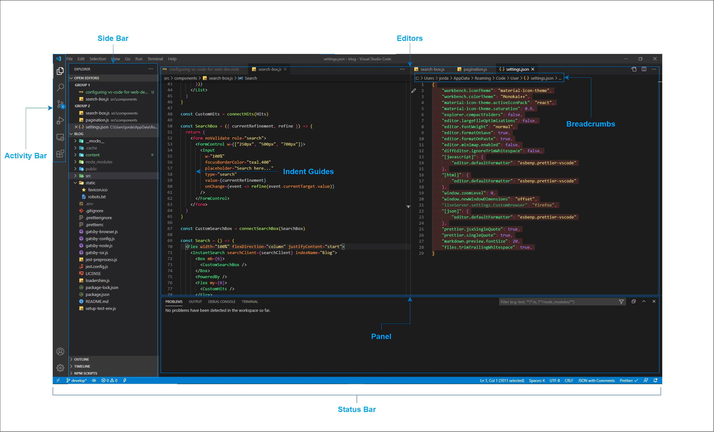
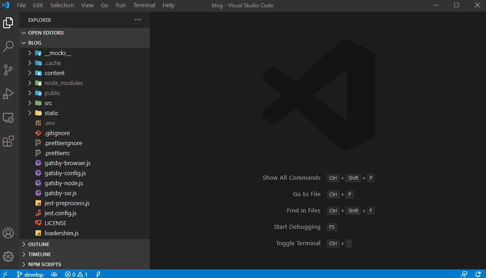
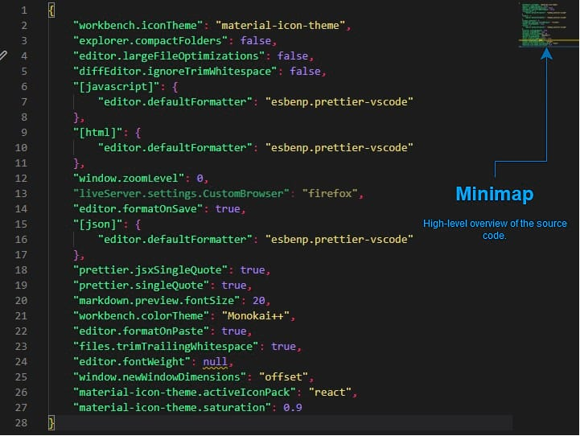
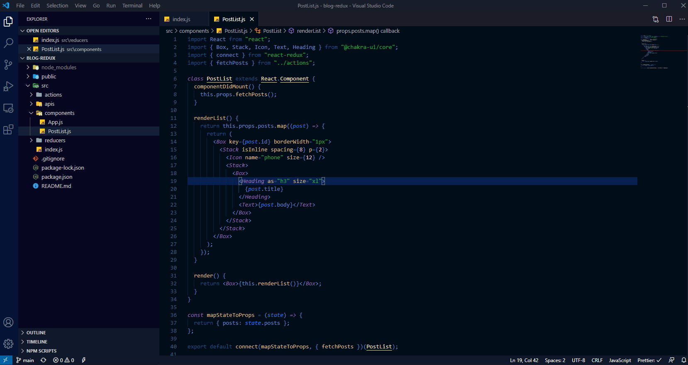
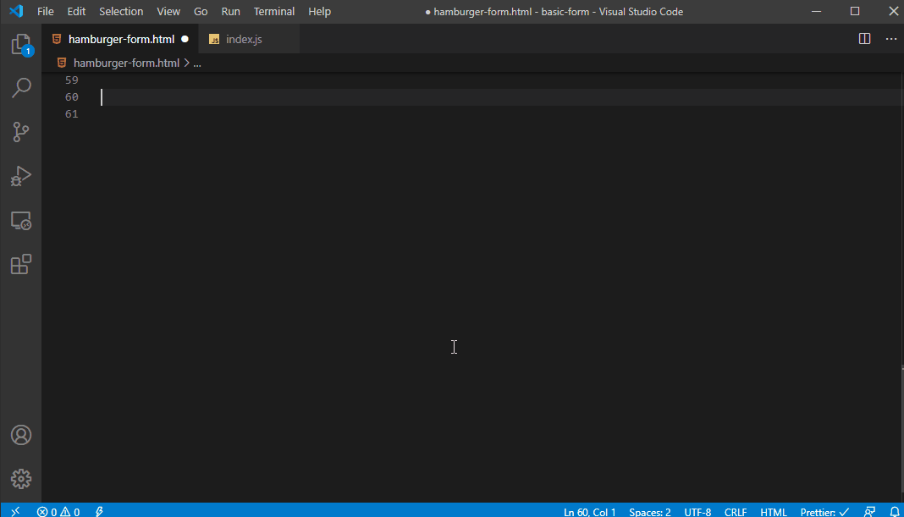
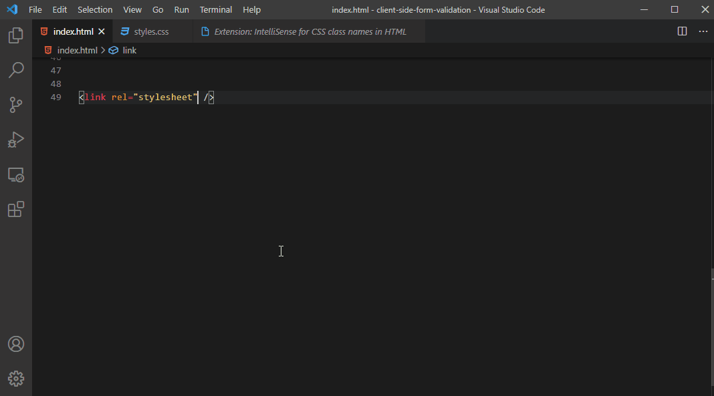

VS Code is a powerful text editor used by web developers all over the world. One of the features that makes it particularly appealing is the high-level of customization that a user can achieve. In addition to the wide variety of options that ship with VS Code, there is a large marketplace that offers access to extensions that can be used to further fine-tune your workflow. Learning how to configure VS Code effectively for web development can help improve your workflow and make for a better experience.

In this article we'll look at how we can configure VS Code for web development.

## Getting started

Before we get to deep into the settings let's have a quick look at the VS Code UI to familiarize ourselves. If you've been using VS Code as your main editor than you can probably skip this section but feel free to follow along.



- **Side Bar**: Contains different views like the Explorer to assist you while working on your project.
- **Editor**: This is where the actual code editing will take place. You can have multiple editors open at once in different layouts.
- **Activity Bar**: Let's you switch between views and see relevant information.
- **Panel**: This can display output and debug information as well as a built-in Terminal. Panel is collapsible for extra screen space.
- **Status Bar**: Various information about the current project and files.
- **Breadcrumbs**: Shows you the file type and path to allow for quick navigation. Optional.
- **Indent Guides**: These help you quickly match indent levels. Disable by setting `"editor.renderIndentGuides": false` in workspace settings.

VS Code is a well thought out application that is fairly comfortable to use right away. However, there are a number of things we can do to improve the UI as well as the functionality for use with web development.

## Basic settings

After I've installed the latest version of VS Code, I like to go through some of the basic settings and configure a few things for my preference. Everyone is going to have different requirements and preferences but here are a few of the settings that I like to adjust right away.

You can access VS Code settings by navigating to `File` > `Preferences` > `Settings` or by pressing the `CTRL` + `,` keys.



1. Disable [MiniMap](https://code.visualstudio.com/docs/getstarted/userinterface#_minimap) - I only enable this feature when I need to search large files or look for lint errors. Generally my React modules are usually small enough that I don't need this regularly but it does have it's advantages.



2. Enable Trim Trailing Whitespace - This removes any additional whitespace at the end of a file.
3. Format on paste and format on save - I like to have these enabled so that Prettier can help me regularly format my code.
4. New Window Dimensions set to `offset` - This will determine the size of a new window when there is one open already. I often have more than one project open at a time and find this useful.
5. Turn off Telemetry - I usually disable telemetry for applications unless there is specific requirement.

### Font

The font will have a big impact on the way the editor looks so it's important to configure it just the way you prefer. Here are a few popular ways to configure the font in VS Code.

- Enable font ligatures. This can help improve the readability of the code. This is a preference, not all developers use ligatures. - Install [Fira Code](https://github.com/tonsky/FiraCode/wiki/VS-Code-Instructions) or similar font containing ligatures.

```json
"editor.fontWeight": "normal",
"editor.cursorWidth": 2,
"editor.letterSpacing": 0.4,
"editor.lineHeight": 20,
"editor.fontSize": 14,
```

## Color themes

VS Code allows you to change the colors in the UI using color themes. This is one of the easiest ways to keep your project organized and a great way to inject some personality into VS Code. First thing you'll want to do is select a new color theme.

### Select a color theme

1. Navigate to `File` > `Preferences` > `Color Theme`
2. Use the up and down arrow keys to preview the themes.
3. Select a theme and press `enter` to confirm selection.



There are some good color themes that come included with VS Code, however if you don't find something you like you have two options:

1. Search the [VS Code Marketplace](https://marketplace.visualstudio.com/VSCode) -
   - Navigate to `File` > `Preferences` > `Extensions` or by pressing `CTRL` + `Shift` + `x`
   - Enter your search. For example to search for color themes, type 'theme' into the search box.
2. [Customize a theme](https://code.visualstudio.com/docs/getstarted/themes#_customizing-a-color-theme). You can customize an active themes colors by setting the `workbench.colorCustomizations` in user settings.

There are a few popular extensions that help visually organize the code. I use these regularly.

- [Monokai++](https://marketplace.visualstudio.com/items?itemName=dcasella.monokai-plusplus) - One of the themes I regularly use. Monokai++ has a pleasant, modern color sheme.
- [Material Icon Theme ](https://marketplace.visualstudio.com/items?itemName=PKief.material-icon-theme) - Making use of file icons is a convenient way to help clearly organize your project.
- [Bracket Pair Colorizer](https://marketplace.visualstudio.com/items?itemName=coenraads.bracket-pair-colorizer) - This extension allows matching brackets to be identified with colors. No more staring at the screen trying to decipher the brackets.
- [Indent Rainbow](https://marketplace.visualstudio.com/items?itemName=oderwat.indent-rainbow) - This extension provides color to the indentation in front of your text.

## Workflow

There are some really impressive extensions available for VS Code that really improves the experience for web developers. Let's have a quick look at some of the most popular VS Code extensions for web development.

> Tip: Extensions can impact system performance. Check extensions if you're experiencing problems.

- [Auto Close Tag](https://marketplace.visualstudio.com/items?itemName=formulahendry.auto-close-tag) - Automatically creates the closing tag when you type the closing bracket of the opening tag.



- [Auto Rename Tag](https://marketplace.visualstudio.com/items?itemName=formulahendry.auto-rename-tag) - Automatically renames closing tags if you update the corrosponding opening tag.
- [ES7 React/Redux/GraphQL/React-Native snippets](https://marketplace.visualstudio.com/items?itemName=dsznajder.es7-react-js-snippets) - Provides some commonly used snippets.
- [IntelliSense for CSS class names in HTML](https://marketplace.visualstudio.com/items?itemName=Zignd.html-css-class-completion) - CSS classname completion for CSS definitions in your workspace.
- [NPM Intellisense](https://marketplace.visualstudio.com/items?itemName=christian-kohler.npm-intellisense) - Autocompletes npm modules in import statements.
- [Path IntelliSense](https://marketplace.visualstudio.com/items?itemName=christian-kohler.path-intellisense) - Extension that autocompletes filenames.



- [Live Server](https://marketplace.visualstudio.com/items?itemName=ritwickdey.LiveServer) - This extension provides an easy to use local server that features live reload. If I'm not using a framework with a dev server I am often using this extention.
- [MDX](https://marketplace.visualstudio.com/items?itemName=silvenon.mdx) - MDX langauge support for VS Code.

Take some time to read about the extensions that are available and ask if it solves a particular problem or not.

## Style / Format

Preferences will vary about styling and formatting your code, luckily VS Code makes it easy to handle different workflows. Extensions like ESLint, Prettier and [Beautify](https://marketplace.visualstudio.com/items?itemName=HookyQR.beautify) all make it easy to setup your style and format preferences in your project.
Features like format on save and format on paste ensure that your code can look great as soon as you start writing it.

- [ESLint](https://marketplace.visualstudio.com/items?itemName=dbaeumer.vscode-eslint) - Integrates ESLint into VS Code.
- [Prettier](https://marketplace.visualstudio.com/items?itemName=esbenp.prettier-vscode) - I use Prettier to format my code. I'll include basic formatting options directly in VS Code settings that are used if project specific settings aren't found.

## Settings

Here's a list of my current VS Code settings if you're interested in using them.

```json
{
  "workbench.iconTheme": "material-icon-theme",
  "workbench.colorTheme": "Monokai++",
  "material-icon-theme.activeIconPack": "react",
  "material-icon-theme.saturation": 0.9,
  "explorer.compactFolders": false,
  "editor.largeFileOptimizations": false,
  "editor.cursorWidth": 2,
  "editor.lineHeight": 20,
  "editor.letterSpacing": 0.4,
  "editor.fontWeight": "normal",
  "editor.fontSize": 14,
  "editor.formatOnSave": true,
  "editor.formatOnPaste": true,
  "editor.minimap.enabled": false,
  "diffEditor.ignoreTrimWhitespace": false,
  "[javascript]": {
    "editor.defaultFormatter": "esbenp.prettier-vscode"
  },
  "[html]": {
    "editor.defaultFormatter": "esbenp.prettier-vscode"
  },
  "window.zoomLevel": 0,
  "window.newWindowDimensions": "offset",
  "liveServer.settings.CustomBrowser": "firefox",
  "[json]": {
    "editor.defaultFormatter": "esbenp.prettier-vscode"
  },
  "prettier.jsxSingleQuote": true,
  "prettier.singleQuote": true,
  "prettier.bracketSpacing": true,
  "prettier.printWidth": 80,
  "prettier.tabWidth": 2,
  "markdown.preview.fontSize": 20,
  "files.trimTrailingWhitespace": true,
  "telemetry.enableTelemetry": false,
  "telemetry.enableCrashReporter": false
}
```

## Wrap up

In this article we took a look at one way to configure VS Code for web development. Although workflow and preferences will always be changing, setting up a solid foundation in your workspace can really help improve the dev experience.

## Further reference

- [Monospace fonts - DIgital Ocean](https://www.digitalocean.com/community/questions/best-monospace-code-fonts-for-developers)
- [Fira Code - GitHub](https://github.com/tonsky/FiraCode) - Free monospaced font containing ligatures for common programming multi-character combinations
